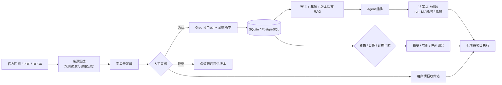

# 校园科创导航智能体架构说明

_V0.5 参赛候选版技术架构，更新于 2026-08-10。_

---

## 🧭 设计目标

系统围绕四个不可破坏的约束设计：纠名、归档后的最终赛事真值入库；来源状态不被伪装；Agent 事实回答只使用同赛事、同年份的本地证据；官方来源变化必须先经人工审核，不得静默覆盖可信事实。

## 🧱 模块边界

| 模块 | 文件 | 职责 |
| --- | --- | --- |
| API | `src/api.py` | HTTP 接口、上传解析、项目与 ICS 导出 |
| 数据访问 | `src/db.py` | SQLAlchemy 模型、幂等灌库、原子项目组合持久化 |
| 契约 | `src/schemas.py` | Pydantic 输入输出模型与枚举 |
| 可信判定 | `src/trust.py` | 官网直链、四类关键证据与报名状态统一检查；未公布团队下限时按 1 人处理 |
| 推荐 | `src/recommendation/engine.py` | 数据有效性、资格门控、软评分 |
| 组合优化 | `src/portfolio/optimizer.py` | 周容量、截止冲突与目标偏好约束下的精确组合求解 |
| 来源雷达 | `src/radar/service.py` | 网页/PDF/DOCX 安全抓取、快照规范化、差异分级与人工审核事件 |
| 检索 | `src/rag/store.py` | 赛事 ID、年份、版本三重隔离检索 |
| Agent | `src/agent/graph.py` | 意图路由、版本消歧、检索、门控、联网降级、结构化 trace 与运行回放 |
| 证据提取 | `src/parsing/pdf_extractor.py` | PDF / Word 通知的页码与正文提取 |
| 前端 | `frontend/` | 用户首页、赛事大厅、机会提醒、作战地图、四种项目视图与智能顾问 |

## 🔒 可信规则

1. `registration_deadline` 和 `submission_deadline` 只从 Ground Truth 或受管理员令牌保护的来源确认接口写入赛事主表。
2. 用户项目只保存 `competition_id`，页面与 ICS 每次从赛事主表读取截止日期。
3. 基础资料完整的 `unverified` 赛事可以参与匹配与项目创建，但必须保留来源状态、核验提示和报名复核边界。
4. 已截止赛事固定返回 `ineligible`、`score=null`，不执行软评分。
5. 同名多年份查询优先匹配用户明确年份；未写年份且存在官方来源锚点时，显式声明使用最新届。如来源或关键字段待补充，必须同时标注信息边界；连官方来源都无法锁定时才追问年份。
6. 评分要求赛事仍可报名、基础资料完整且符合硬性资格；`verified + A` 记录作为推荐级证据样板。官方仅公布团队上限时，最少人数按产品规则为 1。
7. 报名截止问答只输出一个结构化规范日期，RAG 只提供同赛事、同年份的官方证据。
8. 用户资源 API 必须携带未过期的 HMAC 签名会话，且会话 `sub` 必须与路径/查询中的 `user_id` 一致；管理员令牌与用户会话密钥独立。

## 🗃️ 数据关系

`competitions` 是赛事事实唯一来源；`citations` 保存字段级官方页码、原文与来源链接。`source_watches + source_snapshots + source_change_events` 构成来源变化历史，`user_alerts` 保存用户处置动作。`agent_runs` 保存可回放的业务轨迹。`user_projects` 通过 `competition_id` 引用赛事；`project_items` 保存阶段、前置依赖、阻塞原因与证据/雷达来源。删除画像会级联删除用户项目和条目，不删除公共赛事与引用。

## 🔌 主要接口

| 方法 | 路径 | 用途 |
| --- | --- | --- |
| `GET` | `/api/competitions/{id}` | 赛事详情和证据 |
| `GET` | `/api/competitions?readiness=...` | 全部、可推荐或候选赛事目录 |
| `GET` | `/api/agent/ask` | Agent 闭环问答 |
| `GET/POST` | `/api/users/{id}/agent/runs` / `/api/agent/runs/{run_id}/replay` | 运行历史与冻结输入回放 |
| `GET` | `/api/users/{id}/recommendations` | 门控与推荐 |
| `POST` | `/api/users/{id}/projects` | 加入我的项目 |
| `PATCH` | `/api/users/{id}/projects/{pid}/items/{iid}` | 更新条目状态 |
| `GET` | `/api/users/{id}/projects/{pid}/calendar.ics` | 导出日历 |
| `DELETE` | `/api/users/{id}/profile` | 删除画像和项目数据 |
| `POST` | `/api/users/{id}/portfolio/optimize` | 生成三种赛事组合方案 |
| `POST` | `/api/users/{id}/portfolio/apply` | 在单事务中重新校验并原子采用组合方案 |
| `GET` | `/api/radar/status` | 公开的来源健康状态与变化时间线 |
| `GET/POST` | `/api/users/{id}/alerts` / `/api/users/{id}/alerts/{aid}/action` | 用户情报收件箱与接受/忽略/转任务/重规划 |
| `POST` | `/api/admin/radar/run` | 触发一次受限来源扫描 |
| `POST` | `/api/admin/radar/events/{id}/review` | 审核变化并通知受影响项目 |
| `POST` | `/api/admin/*` | 受 `X-Admin-Token` 保护的数据维护接口 |
