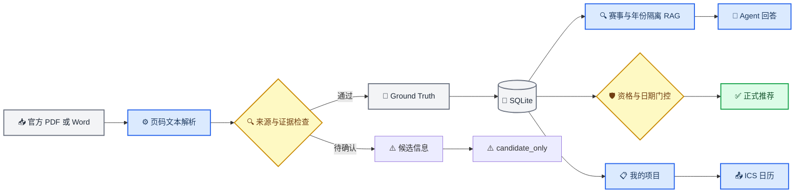

# 校园科创导航智能体架构说明

_提交版技术架构，更新于 2026-07-19。_

---

## 🧭 设计目标

系统围绕三个不可破坏的可信约束设计：Ground Truth 日期原样入库；未核验赛事不进入正式推荐；Agent 的事实回答必须携带同赛事、同年份的官方证据。

## 🧱 模块边界

| 模块 | 文件 | 职责 |
| --- | --- | --- |
| API | `src/api.py` | HTTP 接口、上传解析、项目与 ICS 导出 |
| 数据访问 | `src/db.py` | SQLAlchemy 模型、Ground Truth 灌库、用户项目持久化 |
| 契约 | `src/schemas.py` | Pydantic 输入输出模型与枚举 |
| 可信判定 | `src/trust.py` | 官网直链、五类关键证据与报名状态统一检查 |
| 推荐 | `src/recommendation/engine.py` | 数据有效性、资格门控、软评分 |
| 检索 | `src/rag/store.py` | 赛事 ID、年份、版本三重隔离检索 |
| Agent | `src/agent/graph.py` | 意图路由、版本消歧、检索、门控、回答编排 |
| 前端 | `frontend/` | 赛事、画像、推荐、项目和维护工作台 |

## 🔒 可信规则

1. `registration_deadline` 和 `submission_deadline` 只从 Ground Truth 或受管理员令牌保护的来源确认接口写入赛事主表。
2. 用户项目只保存 `competition_id`，页面与 ICS 每次从赛事主表读取截止日期。
3. `unverified` 赛事固定返回 `candidate_only`、`score=null`、`eligible=false`。
4. 已截止赛事固定返回 `ineligible`、`score=null`，不执行软评分。
5. 同名多年份查询优先匹配用户明确年份；未写年份时仅可使用最新官网来源与关键证据完整版本并显式声明，否则追问。
6. 只有 `verified + A + found + 五类关键证据完整 + 仍可报名` 的赛事可以评分。
7. 报名截止问答只输出一个结构化规范日期，RAG 只提供同赛事、同年份的官方证据。

## 🗃️ 数据关系

`competitions` 是赛事事实唯一来源，`citations` 保存字段级证据。`user_projects` 通过 `competition_id` 引用赛事；`project_items` 保存任务或材料及完成状态。删除画像会级联删除用户项目和条目，不删除赛事与证据。

## 🔌 主要接口

| 方法 | 路径 | 用途 |
| --- | --- | --- |
| `GET` | `/api/competitions/{id}` | 赛事详情和证据 |
| `GET` | `/api/competitions?readiness=...` | 全部、可推荐或候选赛事目录 |
| `GET` | `/api/agent/ask` | Agent 闭环问答 |
| `GET` | `/api/users/{id}/recommendations` | 门控与推荐 |
| `POST` | `/api/users/{id}/projects` | 加入我的项目 |
| `PATCH` | `/api/users/{id}/projects/{pid}/items/{iid}` | 更新条目状态 |
| `GET` | `/api/users/{id}/projects/{pid}/calendar.ics` | 导出日历 |
| `DELETE` | `/api/users/{id}/profile` | 删除画像和项目数据 |
| `POST` | `/api/admin/*` | 受 `X-Admin-Token` 保护的数据维护接口 |
