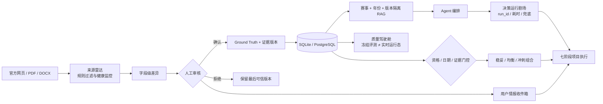

# 校园科创导航智能体架构说明

_提交版技术架构，更新于 2026-10-03。_

---

## 🧭 设计目标

系统围绕四个不可破坏的约束设计：Ground Truth 日期原样入库；未核验赛事不进入正式推荐；Agent 事实回答必须携带同赛事、同年份的官方证据；官方来源变化必须先经人工审核，不得静默覆盖可信事实。

```mermaid
flowchart LR
    official[官方网页 / PDF / DOCX] --> radar[来源雷达<br/>规则过滤与健康监控]
    radar --> diff[字段级差异]
    diff --> review{人工审核}
    review -->|确认| truth[Ground Truth + 证据版本]
    review -->|拒绝| keep[保留最后可信版本]
    truth --> db[(SQLite / PostgreSQL)]
    db --> rag[赛事 + 年份 + 版本隔离 RAG]
    db --> gate{资格 / 日期 / 证据门控}
    rag --> agent[Agent 编排]
    agent --> trace[决策运行剧场<br/>run_id / 耗时 / 兜底]
    trace --> project[七阶段项目执行]
    gate --> portfolio[稳妥 / 均衡 / 冲刺组合]
    portfolio --> project[七阶段项目执行]
    review --> inbox[用户情报收件箱]
    inbox --> project
    db --> quality[质量驾驶舱<br/>冻结评测 ≠ 实时运行态]
```

## 🧱 模块边界

| 模块 | 文件 | 职责 |
| --- | --- | --- |
| API | `src/api.py` | HTTP 接口、上传解析、项目与 ICS 导出 |
| 数据访问 | `src/db.py` | SQLAlchemy 模型、幂等灌库、原子项目组合持久化 |
| 契约 | `src/schemas.py` | Pydantic 输入输出模型与枚举 |
| 可信判定 | `src/trust.py` | 官网直链、五类关键字段证据与报名状态统一检查；未知人数保持未知并阻止评分 |
| 截止时钟 | `src/contest_clock.py` | 使用校园 UTC+08:00 的带时区时钟；精确截止时刻按真实瞬间比较 |
| 推荐 | `src/recommendation/engine.py` | 数据有效性、资格门控、软评分 |
| 组合优化 | `src/portfolio/optimizer.py` | 周容量、截止冲突与目标偏好约束下的精确组合求解 |
| 来源雷达 | `src/radar/service.py` | 网页/PDF/DOCX 安全抓取、快照规范化、差异分级与人工审核事件 |
| 检索 | `src/rag/store.py` | 赛事 ID、年份、版本三重隔离检索 |
| Agent | `src/agent/graph.py` | 意图路由、版本消歧、检索、门控、联网降级、结构化 trace 与运行回放 |
| 证据提取 | `src/parsing/pdf_extractor.py` | PDF / Word 通知的页码与正文提取 |
| 前端 | `frontend/` | 雷达控制塔、作战地图、四种项目视图、运行剧场与质量驾驶舱 |

## 🔒 可信规则

1. `registration_deadline` 和 `submission_deadline` 只从 Ground Truth 或受管理员令牌保护的来源确认接口写入赛事主表。
2. 用户项目只保存 `competition_id`，页面与 ICS 每次从赛事主表读取截止日期。
3. `unverified` 赛事固定返回 `candidate_only`、`score=null`、`eligible=false`。
4. 已截止赛事固定返回 `ineligible`、`score=null`，不执行软评分。
5. 同名多年份查询优先匹配用户明确年份；未写年份仅可明确采用最新来源与字段证据完整版本，否则追问。用户指定的年份不存在时，不偷换为另一届。
6. 只有 `verified + A + found + 五类关键字段证据完整 + 仍可报名` 的赛事可以评分；团队上下限和材料要求必须已知，禁止默认补齐。PDF 必须有有效页码，HTML 可以无页码。
7. 报名截止问答只输出一个结构化规范日期，RAG 只提供同赛事、同年份的官方证据。
8. 用户资源 API 必须携带未过期的 HMAC 签名会话，且会话 `sub` 必须与路径/查询中的 `user_id` 一致；管理员令牌与用户会话密钥独立。
9. 身份展示与队友匹配仅使用预置虚构演示画像，不公开普通注册用户画像。
10. 原始日期不变；可选 `registration_deadline_at` / `submission_deadline_at` 必须带 UTC 偏移并与对应原始日期一致，有额外的时刻原文证据。声明官方时区时，还须具备 `deadline_timezone` 证据；未声明则明确使用校园 UTC+08:00 假设。
11. 到达精确截止瞬间即关闭报名门控；Agent、项目与 ICS 读取同一主表值。精确 ICS 事件转为 UTC，旧日期型通知仍导出全天事件。旧库增量补列，不清空原数据。
12. 本地和远程检索只返回已保存的原文证据，保留证据 ID、文档 ID、SHA-256 和定位信息。年份/版本不符返回空结果；更新时清理该赛事语义缓存，远程旧块不匹配当前原文时不采用。
13. 雷达日期级变更经管理员批准后，清空该字段旧精确时刻、使旧时刻证据及旧定位失效，并降为候选。重新关联新通知的完整证据后才能恢复推荐，不能让新日期沿用旧钟点。

## 🗃️ 数据关系

`competitions` 是赛事事实唯一来源；`citations` 保存字段级官方页码、原文与来源链接。`source_watches + source_snapshots + source_change_events` 构成来源变化历史，`user_alerts` 保存用户处置动作。`agent_runs` 保存可回放的业务轨迹。`user_projects` 通过 `competition_id` 引用赛事；`project_items` 保存阶段、前置依赖、阻塞原因与证据/雷达来源。删除画像会级联删除用户项目和条目，不删除公共赛事与引用。

## 🔌 主要接口

| 方法 | 路径 | 用途 |
| --- | --- | --- |
| `GET` | `/api/competitions/{id}` | 赛事详情和证据 |
| `GET` | `/api/competitions?readiness=...` | 全部、可推荐或候选赛事目录 |
| `GET` | `/api/agent/ask` | Agent 闭环问答 |
| `GET/POST` | `/api/users/{id}/agent/runs` / `/api/agent/runs/{run_id}/replay` | 运行历史与冻结输入回放 |
| `GET` | `/api/users/{id}/recommendations` | 门控与推荐 |
| `POST` | `/api/users/{id}/projects` | 加入我的项目 |
| `PATCH` | `/api/users/{id}/projects/{pid}/items/{iid}` | 更新条目状态 |
| `GET` | `/api/users/{id}/projects/{pid}/calendar.ics` | 导出日历 |
| `DELETE` | `/api/users/{id}/profile` | 删除画像和项目数据 |
| `POST` | `/api/users/{id}/portfolio/optimize` | 生成三种赛事组合方案 |
| `POST` | `/api/users/{id}/portfolio/apply` | 在单事务中重新校验并原子采用组合方案 |
| `GET` | `/api/radar/status` | 公开的来源健康状态与变化时间线 |
| `GET/POST` | `/api/users/{id}/alerts` / `/api/users/{id}/alerts/{aid}/action` | 用户情报收件箱与接受/忽略/转任务/重规划 |
| `POST` | `/api/admin/radar/run` | 触发一次受限来源扫描 |
| `POST` | `/api/admin/radar/events/{id}/review` | 审核变化并通知受影响项目 |
| `GET` | `/api/system/quality` | 冻结评测、回归结果与当前运行态分层输出 |
| `POST` | `/api/admin/*` | 受 `X-Admin-Token` 保护的数据维护接口 |

## v1.3 有状态目标规划

新增 `src/agent/planner.py`，通过目标解析、工具白名单、公开观察和有界循环组织六个工具。证据与时间检查先于正式机会；资格检查产生可比较对象，已有项目容量参与组合求解。下一步只从当前状态允许的工具中选，模型最多调用两次；无法调用或输出非法参数时回退离线策略。最终生成执行清单与三类组合，保留工具轨迹。规划仅仅读取，个人项目写入仍需用户明确采用。

浏览器和演示以离线策略验收，在线模型工具选择的功能通过替身单测验证，未宣称实际在线效果。约束失败停止输出可采用方案，临时画像不覆盖保存资料。当前量化结果见 [提交快照](SUBMISSION_STATUS.md)。
