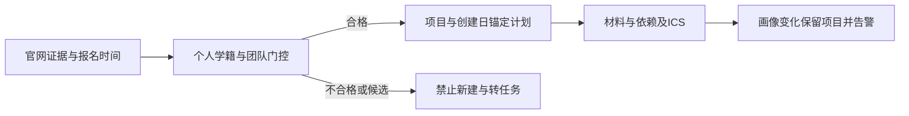

# 非问答真实系统实测与修复记录

日期：2026-10-03。本轮按用户要求暂不修复自然对话、模型余额或在线模型效果；未更换 API Key，未修改演示视频，未部署线上。

项目负责人于2026-10-03明确确认六种画像为真人数据，来源标注据此更正为“真实用户画像（负责人确认）”，未进行独立身份核验。系统使用这些画像在独立SQLite中自动复测，账号由程序创建，浏览器操作实际访问本地服务；这不表示用户本人操作或线上生产验收。B09单独使用模拟响应验证按钮状态，测试替身继续明确披露。来源更正记录见 `evals/user_profile_provenance.json`。

## 修复范围

| 原问题 | 修复与验证 |
| --- | --- |
| 个人资格不符仍能建项目 | 项目创建、组合采用、建议转任务均重新检查学历、年级、专业、团队人数与时间；不符返回409，组合任一失败不写入任何项目 |
| 研一不能保存 | 增加研一至研四及以上、博一至博四及以上、已毕业、大五；画像选项由后端提供，非法学历/年级组合返回422 |
| 专科与高职标签不兼容 | 仅对已知高职高专标签按专科学段比较；职业本科按本科比较，不修改保存的身份，不把中职视作专科 |
| 未知年级被默认转换 | 旧记录无法识别时返回“待确认”，前端要求重新选择；不转换成大一或本科 |
| 创建计划立即逾期 | 系统计划以项目创建日为下限，在官方截止前安排报名与制作；之后读取不按当天顺延，保留真正逾期、已完成和自定任务日期 |
| 候选执行按钮误导 | 候选或个人门控不通过不显示转任务/加入按钮，后端继续强制拦截；画像改变后既有项目保留并显示风险 |
| 制作期已开始误当报名关闭 | 明确报名截止优先于制作阶段开始；只有缺少报名日期时才用开赛时间保守判断 |
| 当前可推荐数据不足 | 补充计挑赛大数据、人工智能、数字媒体三个独立赛项的官网HTML快照、指纹、原文、来源及检查日期；不放宽门控 |

原 `cocr_2026` 为多赛项汇总，清除错误专业/年级限制及从单个程序设计赛套来的统一日期，保持候选。三个新记录只覆盖区域赛/省赛，未将国赛日期混入。HTML不伪造PDF页码；报名时间未给具体时刻时保持未知。

## 实际结果

- `pytest tests -q`：**132/132** 通过，另有 **26 项子测试**通过。
- 正式评测：**15/15**，Ground Truth 与数据库日期 **194/194** 一致。
- 基于真实用户画像的实际API流程复测：**36/36**，画像来源由负责人确认，含注册、资格、项目、材料、依赖、ICS、删除和隐私隔离；结果来自程序实际请求响应，不是满意度分数。
- 浏览器：**9/9** 观察通过；桌面1280×900与手机390×844。B09使用模拟候选响应，只测按钮，不测问答质量或调用在线模型。
- 自动模板回归：**778/778**；它不是独立人工金标，也不代表自然对话失败已解决。

当前194条目录，158条找到官网来源，10条通过关键字段证据规则；固定业务时刻 `2026-10-03T11:00:00+08:00` 有4条可报名。正式推荐还取决于个人资格。新增三条来自同一赛事品牌，不能据此声称专业覆盖已经充分，英语及其他垂直方向仍需持续扩充。

## 浏览器证据

| 用例 | 结果 |
| --- | --- |
| B01 | 研究生研一保存并重新加载成功 |
| B02 | 四人画像无加入按钮，显示人数超过上限 |
| B03 | 绕过前端直接创建返回409 |
| B04 | 原项目保留并显示资格状态变化提醒 |
| B05 | 候选有官网入口，无加入按钮 |
| B06 | 数字媒体制作期开始后仍正确显示报名中 |
| B07 | 新项目计划不早于创建日，阶段日期顺序正确 |
| B08 | 手机画像控件无横向溢出 |
| B09 | 模拟候选响应没有转任务按钮 |

截图：`output/playwright/nonqa-ineligible-desktop.png`、`nonqa-project-warning-desktop.png`、`nonqa-profile-mobile.png`、`nonqa-candidate-task-mobile.png`。首次浏览器截图时本机资源紧张出现 `ERR_INSUFFICIENT_RESOURCES`，重试后上述流程及截图完成；直接请求409为预期资格拦截，不是服务异常。

## 复现

```powershell
$env:OPENBLAS_NUM_THREADS='1'
$env:OMP_NUM_THREADS='1'
.\venv\Scripts\python.exe -X utf8 -m pytest tests -q
.\venv\Scripts\python.exe -X utf8 scripts/run_simulated_user_evaluation.py --scope non-qa
.\venv\Scripts\python.exe -X utf8 evals/run_formal_evaluation.py
.\venv\Scripts\python.exe -X utf8 evals/run_eval.py
```

浏览器脚本为 `scripts/browser_nonqa_check.js`，通过 Playwright CLI `run-code --filename scripts/browser_nonqa_check.js` 执行；只针对独立本地数据库，先用test演示账号登录。原始56项流程评测及失败问答留在 `evals/simulated_user_results.json` 与 `docs/SIMULATED_USER_EVALUATION.md`，保留旧文件名以兼容引用；本轮独立结果为 `evals/nonqa_user_results.json` 与 `evals/nonqa_browser_results.json`，不会用36/36覆盖旧56项分母。本地实际库已先备份至 `tmp/local-before-nonqa-sync.db` 再幂等同步官方种子记录，保留用户画像和项目。


