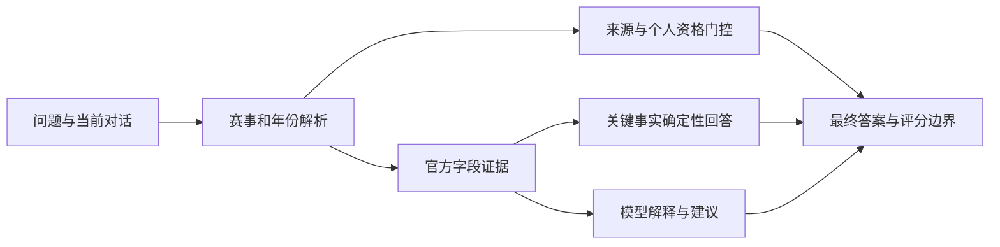

# 问答修复验收

验收日期：2026-10-03。当前轮次修复自然追问、临时人数/学籍陈述、赛项简称、费用拒答、复合日期及候选备赛建议，并验证新接入的在线模型。原始失败报告保留在 `SIMULATED_USER_EVALUATION.md`，不改写历史通过率。

## 实际结果

| 评测层 | 通过/总数 | 模式与边界 |
| --- | --- | --- |
| 自动回归 | 147/147，另26项子测试 | 临时SQLite，无在线模型；新增15项问答回归 |
| 正式验收 | 15/15 | 五类核心规则指标均通过预定义用例，不等于现实资格准确率 |
| 全量模板问答 | 778/778 | 194条赛事各4问，加2条全局问题；不是独立人工金标 |
| 真实用户画像闭环复测 | 57/57，其中问答23/23 | 画像由负责人确认来自真人；执行为TestClient自动复测，不是亲自试用 |
| 在线模型HTTP检查 | 7/7 | 本地真实HTTP及在线模型，小样本；只发送公开证据，无学生个人画像 |
| 浏览器问答检查 | 9/9 | 1440x1080及390x844；真实HTTP，不拦截或伪造响应 |

不同层级不混算分母，也不据此声称用户满意度、获奖概率或线上部署已经验收。

## 修复内容

- 对话上下文由浏览器当前标签页显式传递；仅自然追问沿用，命名新赛事时重新解析。可清除上下文，不从其他用户历史推断。
- 当轮“改成四人”“已经毕业”等陈述参与本次门控和评分，但不静默改写保存的画像；资格不符或未确认时不生成可参赛招募。
- MathorCup大数据与春季赛按独立赛项解析；“今年/明年/去年”按业务年份处理，缺版本时澄清。
- 虚构赛事不能沿用上一赛事作答；多赛比较需要分别明确赛项。
- 截止日期、人数、材料、费用与复合日期问题按所问字段召回。规范报名截止直接来自结构化事实，模型不重写；比赛结束引用独立官方条款。
- 缺费用原文时明确无法确认，不把简介、材料条款当成费用证据。已有简介提到金额也不能代替正式原文引用。
- 候选的备赛建议在全部回答路径保留可信边界；一周计划按七天给通用建议，不使用机械长周期模板，不开放正式转任务。
- 前端模型列表来自后端配置；默认只允许服务配置的模型，额外模型须显式设 `AGENT_LLM_ALLOWED_MODELS`，避免旧模型名称或任意昂贵模型覆盖。
- 修复清除选择与静态缓存问题；移动端标题不拆成单字行。

## 在线验证

当前本地使用 `tokenrhythm` 的 `qwen3.8-flash`。LIVE-06/07轨迹确认模型实际参与生成，而非仅检测配置开关。在线检查包含截止与初赛结束、自然追问、独立赛项简称、候选一周计划、虚构赛事和两项在线建议。

关键事实为确定性回答；模型用于解释和建议。模型故障回退到规则路径，模型生成不能改变评分门控。此次小样本不能证明所有未来模型回答均正确，用户报名仍须查看官网最新通知。

私有密钥仅在被Git忽略的 `.env` 中，不进入报告、代码或提交包。本次没有推送、部署Render或轮换线上数据库凭据；这些仍需目标环境操作。

## 复现与证据

```powershell
.\venv\Scripts\python.exe -m pytest tests -q
.\venv\Scripts\python.exe evals\run_formal_evaluation.py
.\venv\Scripts\python.exe evals\run_eval.py
.\venv\Scripts\python.exe scripts\run_simulated_user_evaluation.py --output evals/qa_user_results.json

# 先启动已配置私有密钥的本地服务；--live明确允许少量付费模型请求
.\venv\Scripts\python.exe scripts\check_live_agent.py --url http://127.0.0.1:8014 --live
```

- `evals/qa_user_results.json`：逐问响应、断言及数据/源码/测试指纹。该轮增加了候选转任务检查，完整分母为57；历史分母为56。
- `evals/live_agent_results.json`：真实HTTP响应、模型参与轨迹、耗时和断言。
- `evals/qa_browser_results.json`：浏览器实际检查及视口，无响应模拟。
- `scripts/browser_agent_check.js`：通过Playwright CLI登录本地预览后执行。
- `output/playwright/qa-agent-desktop.png`、`qa-agent-mobile.png`：浏览器截图。


