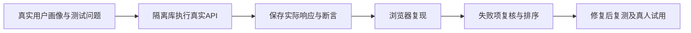

# 真实用户画像的系统流程实测记录

> 此文保留修复前的失败基线，不改写下方历史结果。2026-10-03后续完成非问答修复及自然问答修复，最新完整闭环57/57检查通过，含23条自然问答；在线模型HTTP小样本7/7。详见 [问答修复验收](QA_FIX_VALIDATION.md)；早先非问答36/36记录见 [非问答修复复测](NON_QA_FIX_VALIDATION.md)。不同轮次与分母不能混算。

评测日期：2026-10-03。结论：基础可信查询与执行工具可用，但自然对话、资格一致性和跨学历使用仍有阻塞问题。不建议把现有标准用例通过率理解为真实用户体验已全部合格。

## 评测边界

项目负责人于2026-10-03确认六种画像来自真实用户数据，本报告据此更正画像来源；来源依据为负责人的说明，未进行独立身份核验。API通过TestClient实际调用，浏览器通过本地HTTP访问，测试账号由程序在隔离库中创建。真实画像来源与自动化复测是两回事：本报告不声明六位用户亲自完成测试，不包含真人访谈、满意度调查或独立人工金标。使用离线规则模式，未调用在线大模型、联网搜索，未现场验证全部官网可访问性。

- 六种画像：计算机本科大二、英语本科大一、数学本科大三四人队、研究生研一、高职大二、毕业两年。
- 56 个 API 检查点，包含 23 个自然语言问题，以及注册后画像、推荐、任务材料、依赖、日历和删除流程。
- 使用独立临时 SQLite、真实当前 Ground Truth；业务时刻固定为 `2026-10-03T11:00:00+08:00`，避免过期时间漂移。
- 浏览器另用独立数据库，完成桌面 1440x1080、手机 390x844 检查。浏览器观察不混入 API 分母。
- 学生画像来源为负责人确认的真实用户数据；执行账号为隔离测试账号。此次来源更正不改变历史测试响应、通过率、时间或执行指纹。来源说明见 `evals/user_profile_provenance.json`。

## 结果

API 检查点 **41/56 通过，15/56 失败，检查点通过率 73.2%**。这是本轮预定义场景断言的结果，不是资格准确率、用户满意度或获奖概率。部分检查点包含多项断言，仅全部通过才计为通过。

| 场景分组 | 通过/总数 | 说明 |
|---|---:|---|
| 学籍画像 | 5/6 | 研一画像无法保存 |
| 来源、截止与推荐等边界检查 | 14/15 | 虚构赛事被错锁到真实创新杯；不涵盖全部安全问题 |
| 自然问答与建议 | 7/16 | 上下文、画像冲突、费用、复合问题与计划有缺口 |
| 项目与任务流程 | 9/13 | 三种被门控拒绝的画像仍可建项目；计划一创建就逾期 |
| 隐私授权与资源隔离 | 3/3 | 未授权保存、越权访问和删除画像检查通过 |
| 目录分离筛选 | 3/3 | all/ready/candidate 与后端就绪状态一致 |

浏览器 8 项观察：3 项通过，5 项未达到预期。它们用于复现界面表现，不是另外 8 名用户。

## 优先修复

| 优先级 | 复现用例 | 实际问题 | 建议 |
|---|---|---|---|
| P1 | QA-11 | 保存画像为3人，发言改为4人后仍回答“符合报名硬性条件”，给60.9分；同一回答的官方原文写1至3人 | 当轮条件优先于旧画像；有冲突先确认，不应静默改画像或继续肯定有资格 |
| P1 | JOIN-p03/p05/p06 | 四人队、高职标签画像、毕业生在推荐/Agent中被拒绝，但创建项目HTTP 200且recommendation_ready=true | 统一个人资格门控；不合格只能非正式关注，不能表现为合格参赛项目 |
| P1 | QA-22 | 毕业生gate.eligible=false，仍生成“我们正在为……组队”的正式招募文案 | 组队生成也检查个人门控，明确不能参赛时拒绝生成误导招募 |
| P1 | QA-23，B03/B04 | 计算机赛一周计划误套机械3至6个月模板；候选提示遗漏，转任务按钮可用但点击409 | 精确分类与周期适配；所有回答路径统一追加可信边界；按钮状态使用后端ready/gate |
| P2 | QA-02/03，B02 | 先问截止，再问“这个比赛几个人”时丢失上文 | 保存当前会话锁定赛事，显示可清除的版本上下文；换赛或歧义时再确认 |
| P2 | ON-p04，B05 | 研究生研一无法入库，年级只有大一至大四 | 扩展学段与年级组合，不能用“研究生·大四”代替真实学籍 |
| P2 | QA-12 | 高职大二自述专科在读，因标签不完全等于“专科生”被直接拒绝 | 建立保守学籍映射；无法确定时问确认问题，不自动把所有职业学历视为等价 |
| P2 | QA-17 | 虚构“明年宇宙高校创新杯”被当作“创新杯（原钉钉杯）大学生大数据挑战赛” | 降低弱模糊匹配的自动锁定权限；名称/年份不匹配必须确认，不拿另一赛事答题 |
| P2 | QA-05 | “MathorCup大数据今年怎么报名”只返回泛化多赛澄清 | 补独立赛项简称；若不能确定，列具体候选名称与年份供选择 |
| P2 | QA-18/19 | 问费用返回材料与日期而未拒答；问报名截止和比赛结束只回答前半项 | 分解多字段问题；未找到费用原文明确待确认，不能用不相关证据代替答案 |
| P2 | FLOW-PLAN，B08 | 10月3日创建项目，首项计划日期10月2日 | 将系统建议计划压缩到当前可执行区间；官方报名截止保持原值不变 |

以上是复现问题，不是声称官方规则被人工重新审核。高职案例暴露的是内部学历标签不兼容和需要确认的风险，最终报名身份仍由官网审核。

## 已走通

- 完整赛事名询问大数据赛截止，正确输出 `2026-10-23 12:00`，保留校园 UTC+08:00 时区假设。
- 引用原文、字段、页码和链接能与锁定赛事的入库证据匹配；浏览器证据弹窗可打开。此检查不等于独立确认官方内容准确率100%。
- 显式选定赛事后能回答论文、结果数据集、程序源代码，以及跨校跨专业与1至3人规则。
- 已保存四人画像和毕业生画像时，推荐与Agent门控拒绝且无实际分数；候选、已截止赛事不能新建项目。
- 合格画像可加入正式赛事项目，添加任务与材料，前置未完成时阻止完成依赖项；完成前置后可继续。
- 实际下载ICS，报名截止转为 `DTSTART:20261023T040000Z`，没有改写赛事官方日期。
- 修改保存后的画像会更新推荐；项目删除、画像删除、隐私授权与跨账号读取检查通过。
- 手机问答视口未出现横向溢出，发送按钮可见。未宣称全站所有移动端页面均合格。

## 数据效用

本轮真实种子库191条，7条来源和关键字段完整，业务时刻只有1条同时可报名。计算机大二与英语大一画像各得到同一条大数据赛事；四人队、高职标签和毕业生为0条；研一画像卡在保存环节。

英语新手的推荐标为“暂不优先”、42.6分，来源门控没有放宽，但也没有产生符合其能力方向的丰富选择。应优先补不同专业、当前报名季的完整官方证据，而不是增加大量只可浏览的目录记录。推荐结果少是覆盖问题；不能为了凑数降低门控。

## 复现与文件

```powershell
cd D:\NJUSTAGENT\campus-innovation-agent
.\venv\Scripts\python.exe -X utf8 scripts\run_simulated_user_evaluation.py
```

脚本自行隔离数据库和模型配置，不需要真实API Key。发现未通过的检查点后仍保存全部结果，退出码为1；这不表示脚本未执行完成。本轮报告固定记录上述日期，之后复跑结果变化应同步更新本报告。

- 完整问答、实际响应、逐项断言及代码/数据指纹：`evals/simulated_user_results.json`。
- 浏览器步骤与证据：`evals/simulated_browser_results.json`。
- 截图与下载日历：`output/playwright/sim-user-*`。



建议修复顺序：当轮资格冲突与全流程门控一致性 -> 对话上下文 -> 学籍画像兼容 -> 备赛建议与拒答 -> 活跃赛事覆盖 -> 在线模型同场景验收 -> 3至5名真实学生试用。
