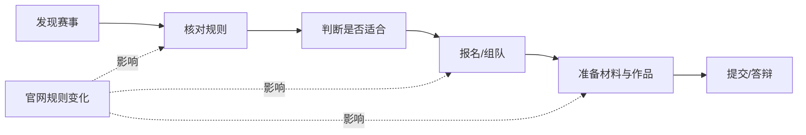
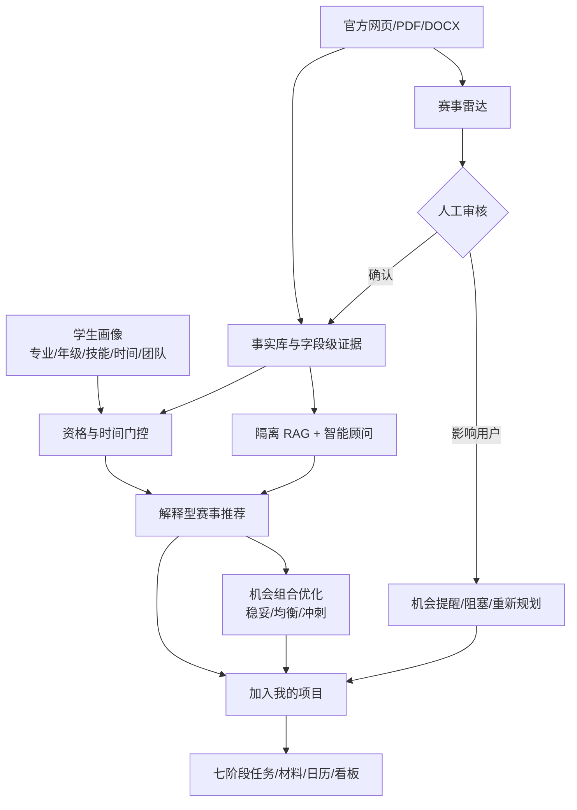
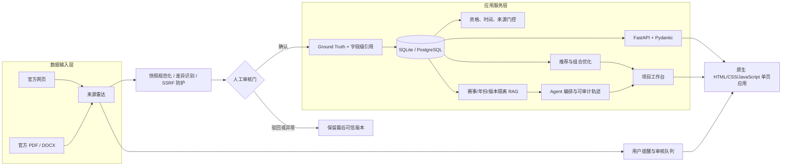

# 校园科创导航智能体：全面调研分析报告（PPT 素材版）

> **用途**：为项目答辩、路演 PPT、项目书或交接材料提供统一事实底稿。  
> **项目版本**：V0.5 参赛候选版。  
> **报告编制日期**：2026-09-05。  
> **数据口径说明**：项目的赛事数据、测试结果和功能冻结口径主要来自 2026-08-10 至 2026-08-11 的项目文档与评测记录；外部竞品页面为本报告编制时可访问的公开信息。本报告将“已实现”“可扩展”严格分开表述。

---

## 0. 一页摘要（可直接用作 PPT 首页）

### 项目一句话

**校园科创导航智能体**是一套面向高校学生的“可信赛事情报 + 个性化决策 + 参赛执行”系统：它不只告诉学生“有什么比赛”，还通过官方证据、资格和时间门控、机会组合、项目任务链与变化提醒，帮助学生将赛事信息转化为可执行的参赛计划。

### 要解决的问题

学生备赛普遍存在五类断点：

1. 赛事信息分散，日期、资格和主办方信息可能过期或失真；
2. 通用赛事平台以“信息展示/报名入口”为主，难以结合学生能力和时间作选择；
3. 官网规则变化后，学生很难判断“这项变化是否影响我的项目”；
4. 报名、组队、材料、制作、提交和答辩分散在不同工具中，执行过程断裂；
5. 普通 AI 问答容易把不同赛事、不同年份的规则混在一起，且网络或模型异常时缺少可靠兜底。

### 当前版本的核心成果

| 项目项 | 冻结口径 / 已实现事实 |
| --- | --- |
| 赛事数据 | 179 条年度化赛事记录；146 条面向前台展示；33 条因旧赛季、重复、纠名失败或来源无法纠正而归档保留审计 |
| 证据状态 | 18 条完成核验，其中 16 条达到 A 级推荐级证据标准；其他基础资料完整赛事保留来源状态与报名复核提醒 |
| 用户闭环 | 画像 → 推荐 → 机会组合 → 加入项目 → 七阶段任务 → 日历/时间线 → 变化提醒 → 可信问答 |
| 工程验证 | 15/15 正式量化用例通过；59/59 自动回归测试通过（冻结评测记录） |
| 部署形态 | 本地一键启动、Docker Compose、Render + PostgreSQL 可选部署；无外网/无大模型时保留本地确定性核心能力 |

### 三个最重要的分析结论

> **结论 1｜产品定位应是“高校科创决策与执行中台”，而不是又一个赛事信息网站。**  
> 单纯堆叠赛事数量很难与成熟聚合平台竞争；本项目的价值在于把可信事实、个人约束、项目推进和变化处置串成闭环。

> **结论 2｜“人工审核后写回事实”的雷达机制，是项目可信度与安全边界的关键。**  
> 它牺牲了完全自动更新的速度，但避免网页噪声、解析错误或恶意内容直接污染推荐、日历和项目任务，适合教育场景。

> **结论 3｜最现实的落地路径是校内 B2B2C 试点。**  
> 先服务学院创新创业中心、竞赛指导教师和一个学生群体，以“赛事台账 + 学生行动闭环”证明价值，再扩展跨学院、跨校赛事数据与官方协同，而非直接与全国性报名平台争夺流量。

---

## 1. 项目核心目标与定位

### 1.1 核心目标

项目以“让学生基于可靠信息做出更合适的参赛选择，并把选择推进为可完成的行动”为总目标，拆分为四项可验证目标：

| 目标 | 具体含义 | 对应实现 |
| --- | --- | --- |
| 建立可信赛事事实底座 | 将赛事名称、届次、资格、节点、材料、来源统一结构化，保留字段级证据 | 年份化赛事记录、Ground Truth、字段级 Citation、来源状态 |
| 提升个体决策质量 | 不只按热度排序，而是先排除不符合资格或已截止赛事，再评估技能、经历、资源与工作量 | 硬门控 + 解释型评分 + 能力缺口 |
| 让推荐能落地 | 将“参加某赛事”的抽象决定变为任务、材料、里程碑和责任进度 | 七阶段项目模板、看板、日历、时间线、ICS 导出 |
| 保持变化下的可靠性 | 规则变化必须可发现、可审查、可影响项目，但不能无审查自动改写事实 | 双层雷达、快照差异、人工审核、用户提醒与重规划 |

### 1.2 产品定位：三个层次

| 层次 | 定位表述 | 面向的实际问题 |
| --- | --- | --- |
| 信息层 | 可信赛事知识库 | “这场赛事的规则、截止日期、来源是什么？” |
| 决策层 | 个性化机会规划器 | “以我的专业、能力和时间，应该投入哪几场？” |
| 执行层 | 参赛项目工作台 | “从现在到答辩，每一步怎么推进？规则变了如何处置？” |

项目并不把大模型作为事实来源。对日期、资格、队伍规模等强约束字段，系统优先使用结构化事实和同赛事、同年份的官方证据；大模型仅是可选的表达润色层，未配置时系统以确定性模板运行。

### 1.3 价值主张

可以将价值主张概括为四句话：

- **推荐有依据**：每个重要事实尽可能关联官方链接、原文、页码/定位、获取日期与核验日期；
- **选择有取舍**：呈现匹配度、能力缺口、工作量、截止冲突，而非只给“推荐/不推荐”；
- **变化可处置**：把官网变化转译为待处理事项，且先审核、后写回；
- **行动能闭环**：从进入赛事到报名、制作、提交、答辩均可被任务化管理。

---

## 2. 痛点、需求与目标用户

### 2.1 典型学生旅程与痛点



| 阶段 | 常见痛点 | 系统的应对方式 |
| --- | --- | --- |
| 发现赛事 | 信息分散、赛事名称相似、旧通知被误用 | 年份化赛事库、正式名称检索、类别/年份/状态筛选、归档审计 |
| 核对规则 | 资格、截止日期、团队人数来自不同网页或 PDF，难以溯源 | 字段级引用、赛事详情、同赛事同年份证据检索 |
| 判断取舍 | 学生不知道自己能力、时间与多个赛事是否匹配 | 学历/年级/时间硬门控，技能/经历/资源/工作量评分，三路线组合 |
| 执行推进 | 多工具切换，常在报名或提交前才发现遗漏 | 七阶段任务链、材料清单、依赖与阻塞、日历/时间线/ICS |
| 面对变化 | 官网发布补充通知后，项目计划不会自动联动 | 雷达差异 → 人工审核 → 提醒/任务/重规划 |

### 2.2 目标用户分层

| 用户角色 | 核心需求 | 当前可获得的价值 |
| --- | --- | --- |
| 本科生/研究生（主用户） | 找到可参与且值得投入的赛事，减少错过节点 | 画像推荐、候选比较、机会组合、项目推进、智能问答 |
| 初次参赛学生 | 不清楚规则、材料与备赛流程 | 首页焦点、资格解释、阶段模板、材料与截止节点 |
| 有经验学生/队长 | 多项目并行，团队分工与时间冲突难协调 | 周容量约束、组合取舍、项目看板、ICS 和风险提醒 |
| 指导教师/学院竞赛负责人 | 维护赛事台账、减少重复答疑、及时发现规则变化 | 管理端数据维护、审核队列、来源健康度、可追溯数据 |
| 学院创新创业中心/教务部门 | 提高参赛组织效率和学生覆盖度 | 可作为校级赛事台账、提醒分发与过程管理基础设施 |

### 2.3 首批试点用户画像

建议首批选择一个学院的 50–200 名学生和 2–5 名赛事指导教师，优先选择赛事密度高、项目周期长的学院，例如计算机、电子信息、机械、设计、商科或创新创业学院。

推荐的首批用户画像为：

- 大二至大三，已有 1–2 项技能，希望通过赛事补齐项目经验；
- 每周可投入 6–15 小时，需要避免多个截止日期重叠；
- 对赛事真实性、校内认定和报名节点敏感；
- 已有项目但缺少过程管理工具，或者尚未参赛但需要“下一步”引导。

> **结论 4｜系统不应只面向“竞赛高手”。**  
> 对新手而言，价值在于减少信息焦虑、提供可执行步骤；对高频参赛者而言，价值在于多项目约束管理。两类用户共用可信数据底座，但交互重点不同。

---

## 3. 主要功能模块与用户闭环

### 3.1 功能全景



### 3.2 主要模块说明

| 模块 | 面向用户的能力 | 关键规则/差异化 | 可用于 PPT 的演示画面 |
| --- | --- | --- | --- |
| 用户登录与能力画像 | 填写学历、年级、专业、技能、经历、周可用时间、预期队伍人数 | 仅收集推荐所需信息；支持删除画像及关联项目 | 登录页、能力画像页 |
| 行动首页 | 聚合今日重点、7 日内节点、项目进度、合适机会、官方变化 | 从“信息堆叠”改为“今天先做什么” | 首页焦点卡片 |
| 赛事大厅 | 正式名称检索与类别/年份/报名状态筛选 | 仅按正式名称检索，减少简介文本的误命中 | 搜索“开源鸿蒙”示例 |
| 赛事详情与证据 | 展示资格、团队、时间、材料、来源与核验状态 | 不把待核验伪装为已确认；字段关联官方证据 | 赛事详情页 |
| 个性化推荐 | 输出适合度、硬门控原因、能力缺口和下一步 | 已截止或不符合硬条件的赛事 `score=null`，不进入软评分 | 推荐卡片页 |
| 机会组合/作战地图 | 输出稳妥、均衡、冲刺三条赛事组合 | 同时考虑每周容量、截止冲突、已有项目和成长目标；采用时原子重校验 | 三列组合方案 |
| 我的项目 | 将赛事转化为任务、材料、状态和里程碑 | 自动生成资格核对→组队选题→报名→方案→制作→提交→答辩七阶段链；阻止跳过前置事项 | 时间线、看板、日历 |
| 赛事雷达/机会提醒 | 发现通知变化并提示用户下一步 | 可行动赛事高频关注；已结束赛事低频发现新赛季线索；所有变化先人工审核 | 机会提醒页、管理审核队列 |
| 智能顾问 | 回答赛事规则、推荐、规划、组队文案与互补队友建议 | 赛事 ID + 年份 + 文档版本隔离；给出引用、数据版本、运行轨迹和兜底状态 | 顾问回答与依据面板 |
| 管理与质量页 | 维护来源、扫描、审核、查看评测口径 | 管理写操作独立令牌保护；冻结评测与实时运行指标分层 | 管理数据维护页 |

### 3.3 推荐与组合的关键逻辑

**推荐不是“一次加权排序”，而是“先门控、再评分、后解释”。**

1. **基础信息检查**：确认赛事最基本的资格、时间、来源等信息是否足以形成候选；
2. **硬条件门控**：已截止、报名不可行、学历/年级/专业/团队硬条件不满足时，直接判为不可推荐；
3. **软评分**：对于可参与赛事，按技能匹配（40%）、竞赛经历（25%）、资源条件（20%）、工作量承受度（15%）计算匹配度；
4. **解释输出**：输出资格、能力匹配、缺口、团队、时间和下一步；
5. **组合求解**：精确枚举不超过四场的可行赛事组合，按周容量、截止日期冲突、目标偏好和已有项目选择“稳妥/均衡/冲刺”方案。

> **结论 5｜机会组合是项目从“推荐系统”走向“决策系统”的分水岭。**  
> 单场推荐回答“哪场更适合”；组合优化回答“有限时间下，哪些赛事一起做仍然可执行”，更贴近真实学生决策。

### 3.4 项目执行七阶段

| 阶段 | 系统任务示例 | 可核验结果 |
| --- | --- | --- |
| 1. 资格核对 | 核对学历、团队规模、报名方式、官方证据 | 避免不符合资格仍投入时间 |
| 2. 组队与选题 | 确认角色分工、选题范围、能力缺口 | 减少队伍与选题不确定性 |
| 3. 报名 | 完成团队信息、报名材料与报名节点 | 关键时间节点可提醒 |
| 4. 方案 | 梳理需求、技术路线、创新点和计划 | 形成可进入制作的方案基线 |
| 5. 制作 | 作品研发、数据/实验、迭代与协作 | 将执行事项状态化管理 |
| 6. 提交 | 核对材料、附件、提交渠道与截止日期 | 降低漏材料和错过截止风险 |
| 7. 答辩 | 准备演示、讲稿、问答与证据包 | 形成可复盘的参赛闭环 |

---

## 4. 技术架构与选型分析

### 4.1 总体架构



### 4.2 技术栈与选型理由

| 层级 | 采用技术 | 选型原因 | 风险/边界 |
| --- | --- | --- | --- |
| 前端 | 原生 HTML、CSS、JavaScript 单页应用 | 无构建步骤、离线演示更轻、便于答辩环境快速启动 | 页面复杂度继续增长后，组件复用与状态管理成本会上升 |
| 后端 | FastAPI + Uvicorn | Python 生态适合数据解析和 AI 编排；自动接口文档；异步能力适合雷达任务 | 生产环境需增加多进程、限流与观测配置 |
| 数据契约 | Pydantic | API 输入输出校验和枚举约束，降低前后端字段不一致 | 需要持续维护契约版本 |
| 数据库 | SQLAlchemy；默认 SQLite，可切 PostgreSQL | 本地演示零依赖，云端可使用 PostgreSQL 保证持久化 | SQLite 适合演示/小规模；多用户并发需迁移 PostgreSQL |
| 文档解析 | pdfplumber、python-docx | 提取官方 PDF/Word 正文、页码、表格，构建字段级证据 | 扫描型 PDF 需要 OCR 或人工关联原始页码 |
| RAG | 结构化字段 + 关键词 + 可选语义向量；按赛事/年份/版本隔离 | 强事实优先精确字段；可选离线 `all-MiniLM-L6-v2` 增强同义表达；不依赖外网 | 默认轻量模式并非大规模向量平台；大规模语料需接入远程 Chroma 等服务 |
| Agent | LangGraph 可选；缺失时使用内置图编排兼容层 | 意图识别→版本消歧→检索→门控→表达分层；无可选依赖时仍可运行 | 当前以规则与确定性流程为主，复杂开放式对话能力有限 |
| LLM | 可选 OpenAI 兼容接口，仅润色表达 | 不配置密钥时仍可离线运行；引用和门控结论受保护 | 启用后涉及第三方服务、成本、出境与稳定性评估 |
| 部署 | 本地启动脚本、Docker Compose、Render Blueprint | 兼顾课堂/比赛离线演示与云端试用 | 免费云服务可能冷启动；生产需完善 CI/CD、备份与监控 |

### 4.3 数据与可信架构

系统的核心不是“抓取后立即展示”，而是以下数据治理链路：

```text
官方来源 → 文本/文档解析 → 字段候选与快照 → 变化检测
→ 人工审核 → Ground Truth 与证据版本 → 数据库
→ 推荐/项目/RAG/智能顾问 → 用户界面
```

关键数据对象包括：

| 对象 | 作用 |
| --- | --- |
| `competitions` | 赛事事实唯一来源；项目不复制截止日期，避免副本漂移 |
| `citations` | 保存字段、原文、页码/定位、链接、获取与核验日期、可信等级 |
| `source_watches` / `source_snapshots` / `source_change_events` | 保存来源监控规则、抓取快照和变化历史 |
| `user_alerts` | 保存用户对变化的接受、忽略、转任务、重新规划等动作 |
| `agent_runs` | 保存可审计业务轨迹、运行摘要和冻结输入回放信息 |
| `user_projects` / `project_items` | 保存项目、阶段、依赖、阻塞原因、材料和证据/雷达关联 |

### 4.4 隔离 RAG 的设计价值

传统 RAG 常把所有文档混入一个向量库，仅依赖 Top-K 相似度；在赛事场景中，易发生两类高风险错误：

- 不同赛事名称/规则相似而产生“跨赛事串证”；
- 同一赛事的不同届次规则不同而产生“跨年份混用”。

本项目以 `competition_id + 年份 + 文档版本` 构成硬隔离边界，结构化字段对日期、资格等强事实优先命中；关键词与可选语义向量仅用于辅助召回。证据不足时，系统应拒绝编造或提示复核。

> **结论 6｜在高风险事实问答中，隔离边界比“模型更聪明”更重要。**  
> 通过数据域约束减少错误候选，比让模型在混合语料中猜测正确答案更可控，也更容易审计。

### 4.5 安全与合规设计

| 风险点 | 已有控制 |
| --- | --- |
| 个人数据过度采集 | 只收集学历、年级、专业、技能、经历、周可用时间和预期队伍人数；不收身份证、住址、学号、成绩、生物信息 |
| 用户数据越权 | 短期 HMAC 签名会话；用户资源校验会话主体；未登录 401、跨用户 403 |
| 管理操作越权 | 管理写接口使用独立 `X-Admin-Token`；未配置令牌时接口关闭 |
| 外部抓取 SSRF | 仅允许公网 HTTP(S)，拦截本机、内网、链路本地与非授权协议 |
| 自动更新污染事实 | 雷达变化只进入人工审核队列，未审核前保留最后可信版本 |
| LLM 幻觉/网络故障 | 强事实使用本地证据与门控；联网/LLM 失败回退确定性模板；外部搜索结果不混入官方引用 |
| 数据删除 | 用户可删除画像，关联项目、任务和材料级联删除；公共赛事证据不受影响 |

---

## 5. 市场与竞品对比

### 5.1 市场判断

高校竞赛服务市场并非空白：已有成熟平台提供赛事发布、竞赛信息、报名入口、备赛内容、证书或活动服务。例如，赛氪公开定位中覆盖竞赛导航、报名、资讯、课程与就业成长服务；大学生竞赛信息网公开展示赛事公告、报名通道、参赛指南和成果展示；去大赛网则以赛事分类与信息分享为主。[赛氪产品介绍](https://www.saikr.com/products) [赛氪首页](https://sta.saikr.com/) [大学生竞赛信息网赛事中心](https://www.xunda188.com/events) [去大赛网](https://www.godasai.com/)

因此，本项目不宜用“第一个大学生赛事平台”叙述自己。更准确的市场定位是：**在成熟赛事信息/报名平台与校内竞赛管理之间，补足“可信决策 + 持续变化处置 + 项目执行闭环”的空白。**

### 5.2 竞品分层

> 注：下表基于各产品公开页面的定位与可见功能比较，不推断竞品未公开的后台能力；“本项目优势”是定位差异，不等同于竞品绝对缺失该能力。

| 竞品/替代方案 | 公开定位与强项 | 对学生的典型价值 | 与本项目的关系 | 本项目应主打的差异 |
| --- | --- | --- | --- | --- |
| 赛氪 | 全国大学生竞赛活动平台；公开介绍包含赛事导航、报名、资讯、课程和成长服务 | 广覆盖赛事发现、报名入口、备赛资源 | 直接替代“找赛事/报名”环节 | 聚焦校内学生的个人约束、字段级证据、项目执行和审核式变化联动；不与其比赛事流量规模 |
| 大学生竞赛信息网 | 聚焦高校竞赛生态，公开展示公告、报名、指南和成果展示 | 获取赛事信息与参赛说明 | 替代“竞赛资讯门户” | 将“公告/指南”进一步变成可计算的资格、节点、任务和提醒 |
| 去大赛网等赛事资讯/分享站 | 按文理、专业与活动分类聚合比赛信息 | 多类别赛事浏览和信息分享 | 替代“泛检索/赛事目录” | 以年度化纠名、归档审计、来源状态透明来降低过期/同名信息风险 |
| 单项赛事官方报名系统 | 由赛事主办方服务特定比赛的报名、材料提交与咨询；例如创新大赛通知要求通过官方系统统一注册 | 最终报名与官方规则确认 | 不可替代，必须尊重其权威性 | 本项目定位为“赛前决策与过程协同层”，在最终报名环节跳转或提示官方渠道，而非替代官方平台 |
| 校内表格、微信群、教师人工通知 | 高度贴近本校政策和教师经验 | 本校认定、个别答疑、组织动员 | 最常见的现实替代方案 | 将教师经验与公共赛事事实结构化，减少重复答疑，同时保留人工审核与最终裁量 |

有关创新大赛等具体赛事，官方通知通常要求队伍在指定官方系统完成统一注册，因此本项目的边界应明确为“辅助决策与执行”，最终报名资格仍以主办方和学校要求为准。[2026 中国国际大学生创新大赛通知示例](https://jkxy.xafu.edu.cn/__local/D/6B/E9/D1ACE9C7B17C22104E4E5146ECD_4743DCA7_56A68.pdf)

### 5.3 差异化矩阵

| 能力维度 | 赛事信息/报名平台 | 官方单赛事系统 | 校内人工管理 | 校园科创导航智能体 |
| --- | --- | --- | --- | --- |
| 广泛赛事发现 | 强 | 弱（仅本赛事） | 中 | 中（当前以 146 条前台展示赛事为冻结基线） |
| 官方报名/支付/证书 | 常见强项 | 强 | 中 | **不替代**，应跳转官方渠道 |
| 字段级证据与年份隔离 | 公开定位未必强调 | 对单赛事强 | 依赖人工 | 强：证据、年份、版本纳入数据模型 |
| 个性化资格门控 | 通常偏通用筛选 | 无 | 依赖教师经验 | 强：学历/年级/专业/时间/团队等门控 |
| 多赛事时间与容量取舍 | 弱或不作为主定位 | 无 | 人工经验 | 强：稳妥/均衡/冲刺组合 |
| 项目执行任务链 | 非主定位 | 仅报名流程 | 分散在群/表格 | 强：七阶段任务、依赖、材料、日历、时间线 |
| 规则变化到项目联动 | 资讯/通知为主 | 单赛事通知 | 人工转发 | 强：雷达、人工审核、提醒、转任务/重规划 |
| 离线可运行与可审计兜底 | 不一定适用于现场 | 依赖官方平台 | 人工 | 强：本地事实库、确定性回退、运行轨迹 |

### 5.4 竞争策略建议

1. **不做“大而全赛事门户”**：不以赛事数量、广告、流量或报名交易为第一指标；
2. **做“可信且可执行”的校内协同层**：把官方报名系统、外部赛事平台和校内教师工作流连接起来；
3. **以一个学院试点形成数据闭环**：优先覆盖该学院最常参加的 20–50 个赛事，做深核验和全过程服务；
4. **以教师端证明组织价值**：展示赛事台账、来源审核、风险提醒、学生项目分布和节点管理；
5. **以接口/导入而非替换切入**：后期可对接校内竞赛认定目录、教师通知、官方赛事链接，避免重新构建成熟平台已有的报名交易能力。

> **结论 7｜本项目的竞争壁垒不在“更多赛事”，而在“更可靠的数据治理和更贴近个人执行的决策闭环”。**  
> 赛事信息平台已经成熟；项目应把资源集中于“事实可信、决策可解释、变化可处置、过程可完成”。

---

## 6. 可行性评估

### 6.1 产品可行性

| 维度 | 评估 | 依据 | 结论 |
| --- | --- | --- | --- |
| 痛点真实性 | 高 | 赛事信息、资格判断、时间冲突和执行碎片化均是学生备赛高频问题 | 适合从“竞赛高频学院”小范围试点 |
| 用户学习成本 | 中低 | 首页、赛事大厅、推荐、项目工作台符合“发现—选择—执行”自然路径 | 需继续优化首次画像填写和新手引导 |
| 替换成本 | 中 | 不取代官方报名，不要求学生迁移全部工具 | 以“增加一层决策与管理能力”更易被接受 |
| 用户留存机制 | 中高 | 节点提醒、项目状态、规则变化和阶段任务提供持续使用理由 | 需要真实通知频率和优质提醒，避免通知疲劳 |

### 6.2 技术可行性

| 维度 | 评估 | 已有基础 | 后续要求 |
| --- | --- | --- | --- |
| 本地演示与交付 | 高 | FastAPI、SQLite、原生前端、离线确定性 RAG、启动脚本和 Docker 已具备 | 保持一键启动与演示数据隔离 |
| 数据解析与证据 | 中高 | PDF/Word 提取、字段引用、Ground Truth、归档机制已具备 | 扫描 PDF OCR、网页结构变化和人工审核效率仍需加强 |
| 个性化推荐 | 中高 | 门控、解释评分和组合优化已实现 | 应以真实学生反馈校准权重，避免“高分即最佳”的误导 |
| 智能问答 | 中高 | 赛事隔离 RAG、版本消歧、确定性回退和 trace 已实现 | 扩大语料后需持续评测跨赛事/跨年份污染率 |
| 雷达监控 | 中 | 快照、差异、SSRF 防护、人工审核已实现 | 需解决反爬、动态页面、源站不可用、任务调度和告警运维 |
| 校园级并发 | 中 | PostgreSQL、容器和云端部署路径已提供 | 需补充缓存、队列、限流、备份、审计和可观测性 |

### 6.3 运营与数据可行性

数据质量是本项目最重要的长期成本。当前版本已经采用“不能确认就不编造、无法纠正就归档”的原则，这是正确方向；但随着赛事覆盖面扩大，人工审核、来源维护与校内政策差异将决定产品质量上限。

建议形成以下运营机制：

| 机制 | 建议 |
| --- | --- |
| 赛事准入 | 先纳入高频、正式、院校关注度高的赛事；明确来源、届次和最低关键字段 |
| 证据分级 | A 级用于强推荐示例；B/C 级可作为候选或导航信息，但必须展示信息边界 |
| 变更 SLA | 报名/提交/资格关键字段变化：24 小时内审核；一般资讯变化：按周维护 |
| 人工责任 | 明确“谁审核、谁确认、谁发布、谁处理异常”；保留审核理由与历史版本 |
| 校内规则 | 将本校竞赛认定、学分/综测、校赛入口与全国规则分层保存，避免混淆 |
| 用户反馈 | 增加“日期不对/规则更新/信息补充”入口，经管理员审核后进入事实库 |

### 6.4 经济与资源可行性

短期试点的成本主要不是算力，而是数据运营与教师协同：

- **基础设施成本低**：默认 SQLite 与本地检索可离线运行；Docker、Render/云主机可满足试点；
- **模型成本可控**：没有外部 LLM 密钥时核心功能仍然可用；接入 LLM 仅改善表达，不承担事实判断；
- **人工审核成本显著**：赛事新增、来源变化和校内规则维护需要明确人力；
- **试点资源建议**：1 名产品/数据维护学生助理 + 1 名教师审核人 + 1 名开发维护人员，可支撑单学院首期验证。

> **结论 8｜项目的技术成本可控，真正需要前置投入的是“可信赛事数据运营”。**  
> 若没有审核职责、来源标准和更新节奏，再好的推荐算法也会被错误或过期数据削弱。

---

## 7. 潜在风险、挑战与应对方案

| 风险类别 | 具体风险 | 影响 | 当前已有控制 | 建议补强 |
| --- | --- | --- | --- | --- |
| 数据准确性 | 同名不同届、旧通知、地方赛与全国赛混淆 | 错过报名或错误推荐，直接伤害信任 | 年份化记录、归档审计、字段证据、无法确认不编造 | 设立关键字段双人复核与来源健康看板 |
| 来源变动 | 官网改版、PDF 更新、动态页面、反爬或暂时不可访问 | 雷达失效或产生误报 | 快照、差异、失败保留最后可信版本、stale 状态 | 增加多来源备份、重试策略、人工订阅与变更 SLA |
| 自动化误写 | 抓取噪声被直接写回事实或日历 | 影响大量学生计划 | 人工审核门，未审不改写主表 | 审核前后版本对比、回滚、影响范围预估 |
| 推荐误导 | 权重不合理、学生画像不完整、把建议当最终资格结论 | 选择偏差、投诉 | 硬门控、解释、官网复核提示 | 允许用户调节目标权重；引入教师校验与反馈闭环 |
| LLM 幻觉 | 模型补造规则、丢失引用或网络异常 | 高风险事实错误 | LLM 仅润色；标记保护失败回退；本地证据优先 | 增加模型输出审计、敏感字段结构化渲染、红队测试 |
| 隐私与权限 | 用户画像、项目与队伍信息泄露 | 合规与信任风险 | 最小化采集、HMAC 会话、所有权校验、级联删除 | 密码哈希策略审计、HTTPS、日志脱敏、数据保留周期与权限分级 |
| SSRF/外链安全 | 雷达抓取内网地址或恶意 URL | 网络安全风险 | 公网 HTTP(S) 限制，拦截内网/本机 | DNS 重绑定防护、出站代理、域名白名单与抓取沙箱 |
| 系统可用性 | 免费云冷启动、单点数据库、外部服务超时 | 现场演示或学生使用中断 | 离线回退、健康检查、本地启动 | 生产级监控、备份、队列、缓存、容灾预案 |
| 竞品压力 | 大平台有更广赛事和官方报名资源 | 用户可能只用资讯平台 | 不替代报名，做决策执行层 | 与学院工作流和官方链接集成，形成组织侧粘性 |
| 运营边界 | 学校认定政策、最终资格由各校/组委会决定 | 产品被误认为官方裁决 | 明确辅助决策、显示来源状态 | 在页面和导出物中持续保留免责声明与更新时间 |

### 风险优先级建议

1. **最高优先级**：数据准确性、来源变动、自动化误写、隐私权限；
2. **高优先级**：推荐误导、LLM 幻觉、系统可用性；
3. **中优先级**：竞品压力、扩展成本、通知疲劳；
4. **持续治理项**：校内政策差异、教师审核负担、数据覆盖深度。

> **结论 9｜项目最需要避免的失败模式是“看起来很智能，但给出了过期或无依据的报名结论”。**  
> 因此，“不确定就标注、变化先审核、最终以官网为准”应始终比“回答得更快、更像 AI”优先。

---

## 8. 落地路线与阶段性目标

### 8.1 推荐落地路径

| 阶段 | 周期建议 | 目标 | 最小交付 | 验证指标 |
| --- | --- | --- | --- | --- |
| 阶段 0：赛题/演示版 | 已完成 | 验证可信赛事—推荐—项目闭环是否可运行 | 当前 V0.5、演示视频、测试与文档 | 15/15 正式评测、59/59 回归（冻结口径） |
| 阶段 1：单学院试点 | 1 个学期 | 验证真实用户是否愿意按推荐创建项目并完成节点 | 20–50 场高频赛事、50–200 名学生、教师审核台账 | 画像完成率、项目创建率、关键节点按时完成率、教师节省答疑时长 |
| 阶段 2：校内协同 | 1 年 | 接入校内赛事认定、学院通知与指导资源 | 多学院赛事目录、角色权限、校内政策字段、数据审计 | 覆盖学院数、活跃项目数、有效提醒率、规则纠错时效 |
| 阶段 3：跨校/生态连接 | 1–2 年 | 做成可复用赛事数据与参赛管理能力 | 标准数据模型、导入 API、官方链接/平台跳转、运营规范 | 数据复用校数、来源健康度、跨校数据一致性 |

### 8.2 MVP 与后续增强的边界

**当前已具备、适合现场演示的能力**：

- 赛事大厅、正式名称检索、赛事详情和来源状态；
- 个人画像、资格/时间门控、可解释推荐；
- 稳妥/均衡/冲刺机会组合与约束说明；
- 项目七阶段、看板、日历、时间线、ICS；
- 雷达快照差异、人工审核、用户提醒；
- 隔离 RAG、可信智能顾问、运行轨迹与离线回退；
- 本地/Docker/云端部署、测试、合规控制。

**建议作为下一阶段而非“当前已完成”宣传的能力**：

- 正式接入多所学校的竞赛认定目录和统一身份系统；
- 学生之间的真实队友社交与即时通信；
- 全量 OCR、复杂网页自动抽取和多媒体证据识别；
- 大规模实时监控调度、分布式队列、生产级告警；
- 真实使用数据驱动的推荐权重学习与 A/B 测试；
- 与官方报名平台的深度流程集成。

### 8.3 建议的试点评价指标

| 维度 | 指标示例 | 解释 |
| --- | --- | --- |
| 数据可信 | A/B 级来源覆盖率、关键字段可追溯率、过期数据发现时效 | 衡量“敢不敢推荐” |
| 决策有效 | 可报名推荐点击率、组合采用率、学生手动排除原因 | 衡量“推荐是否有用” |
| 执行闭环 | 项目创建率、任务完成率、截止前完成率、ICS 导出使用率 | 衡量“是否从浏览走向行动” |
| 雷达质量 | 有效变更率、误报率、人工审核时长、受影响项目处置率 | 衡量“变化是否真正可用” |
| 用户体验 | 首次完成画像时长、问题解决率、NPS/满意度 | 衡量“是否易上手” |
| 安全合规 | 越权访问拦截率、删除请求完成率、敏感信息采集项数量 | 衡量“是否守住边界” |

---

## 9. 答辩叙事与 PPT 制作建议

### 9.1 推荐的 12 页 PPT 结构

| 页码 | 标题 | 关键信息 | 推荐素材 |
| ---: | --- | --- | --- |
| 1 | 封面：校园科创导航智能体 | 一句话定位：“从赛事信息到可执行参赛计划” | 产品首页主视觉 |
| 2 | 为什么需要它 | 信息真假难辨、选择不可解释、变化难落地、执行碎片化 | 学生旅程痛点图 |
| 3 | 我们的解决方案 | 可信情报 → 个性决策 → 项目执行闭环 | 全链路流程图 |
| 4 | 核心创新一：可信赛事事实 | 年份化、纠名归档、字段级证据、人工审核 | 赛事详情与来源示意 |
| 5 | 核心创新二：从推荐到组合 | 硬门控、能力缺口、稳妥/均衡/冲刺 | 三种机会组合截图 |
| 6 | 核心创新三：变化可处置 | 双层雷达、人工审核、提醒转任务/重规划 | 机会提醒页面 |
| 7 | 核心创新四：项目执行闭环 | 七阶段任务、依赖、看板、日历、时间线 | 项目时间线/看板截图 |
| 8 | 核心创新五：可信智能顾问 | 赛事隔离 RAG、引用、运行轨迹、离线回退 | 智能顾问回答页面 |
| 9 | 技术架构与安全 | FastAPI、数据库、RAG、雷达、权限与 SSRF 防护 | 架构图 |
| 10 | 数据与工程质量 | 179/146/33、18/16、15/15、59/59；注明冻结口径 | 数据与测试图表 |
| 11 | 竞品与落地策略 | 不做信息门户，做校内决策与执行中台 | 差异化矩阵 |
| 12 | 试点价值与愿景 | 单学院试点→校内协同→跨校复用；回到“让学生少走弯路” | 三阶段路线图 |

### 9.2 答辩时建议强调的表达

- 不说：“我们用 AI 自动替学生判断能不能参赛。”  
  应说：“系统先按公开规则进行辅助门控，并将最终资格判断保留给赛事官方通知和学校要求。”

- 不说：“我们拥有最全的竞赛库。”  
  应说：“我们优先构建可追溯、可维护、可用于决策的赛事事实库。”

- 不说：“雷达自动修改赛事数据。”  
  应说：“雷达只发现变化，人工审核后才更新可信事实。”

- 不说：“大模型保证答案正确。”  
  应说：“模型不负责生成关键事实；系统以同赛事、同年份证据和结构化门控保证边界。”

- 不说：“我们替代官方报名平台。”  
  应说：“我们在报名之前帮助学生决策，在报名之后帮助学生推进；最终报名回到官方渠道。”

### 9.3 可直接朗读的项目总结

> 校园科创导航智能体不是一个单纯的赛事列表，也不是一个只会聊天的 AI。它从官方公开资料出发，先把赛事事实、届次和证据管理清楚；再结合学生的能力、时间和团队约束，给出有理由的参赛选择；最后将选择变成可以推进的任务、材料和时间线。当官网规则发生变化时，系统不会盲目自动改写数据，而是通过人工审核后提醒受影响学生并协助调整计划。我们希望让学生把精力从反复搜索、核对和担心错过节点中释放出来，真正投入到创新实践本身。

---

## 10. 资料来源与事实边界

### 10.1 本项目内部资料（报告主要依据）

- [项目 README](../README.md)：产品能力、数据口径、部署、配置与测试入口；
- [参赛作品说明](../参赛作品说明.md)：项目故事线和演示能力；
- [技术架构](ARCHITECTURE.md)：模块边界、可信规则、数据关系、主要接口；
- [RAG 架构](RAG_ARCHITECTURE.md)：隔离检索、轻量降级与引用门控；
- [创新点单页](INNOVATION_HIGHLIGHTS.md)：五项可验证创新点；
- [合规说明](COMPLIANCE.md)：数据来源、隐私、安全与自动决策边界；
- [量化评测报告](QUANTITATIVE_EVALUATION.md)：15/15 正式用例、59/59 自动回归的冻结记录；
- [测试用例](TEST_CASES.md)：正常、异常、边界与安全覆盖；
- [部署说明](DEPLOYMENT.md)：本地、Docker 与云端部署；
- [数据复核报告](../data/VERIFICATION_REPORT.md)：来源核验、纠名与归档原则。

### 10.2 外部竞品与市场参考（公开页面）

- [赛氪产品介绍](https://www.saikr.com/products)：赛事报名、资讯等公开功能定位；
- [赛氪首页](https://sta.saikr.com/)：竞赛导航、课程/资料、资讯与成长服务公开定位；
- [大学生竞赛信息网赛事中心](https://www.xunda188.com/events)：赛事公告、报名通道、参赛指南、成果展示等公开介绍；
- [去大赛网](https://www.godasai.com/)：赛事分类与信息分享的公开页面；
- [2026 中国国际大学生创新大赛通知示例](https://jkxy.xafu.edu.cn/__local/D/6B/E9/D1ACE9C7B17C22104E4E5146ECD_4743DCA7_56A68.pdf)：官方系统统一注册的赛事流程示例。

### 10.3 使用本报告时的注意事项

1. **不要将冻结测试成绩描述为长期线上服务 SLA**：15/15 与 59/59 仅适用于当时冻结数据与测试范围；
2. **不要把“18 条已核验、16 条 A 级”误说为“全部赛事已人工核验”**；
3. **不要把系统推荐描述为官方资格裁决或自动报名**；
4. **外部平台功能以其公开页面为准**，本报告不对其未公开技术能力作判断；
5. **市场分析以产品策略为主，不含市场规模、营收或用户量预测**；如需商业计划书，应另行开展用户访谈、学校采购意愿和成本模型调研。

