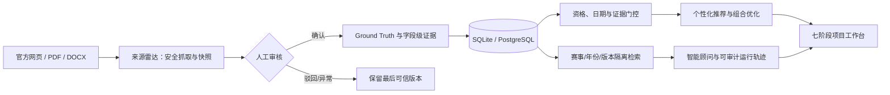

# 技术文档

## 1. 系统定位与技术路线

校园科创导航智能体把“赛事资料”转化为可执行的学生参赛闭环：用户画像输入后，系统完成资格与时间门控、解释型匹配、三种机会组合、七阶段项目推进、来源变化提醒与可追溯问答。关键事实不由大模型生成；Agent 只在同赛事、同年份的本地证据范围内组织回答，网络或模型不可用时自动回退确定性逻辑。

## 2. 模块说明

| 模块 | 实现 | 作用 |
| --- | --- | --- |
| 前端单页应用 | `frontend/` 原生 HTML/CSS/JavaScript | 首页、赛事大厅、匹配建议、行动路线、项目四视图、提醒与智能顾问 |
| API 与认证 | `src/api.py` | FastAPI 路由、HMAC 会话、资源所有权校验、健康检查 |
| 数据与证据 | `src/db.py`、`src/schemas.py`、`src/trust.py` | SQLite/PostgreSQL、179 条年度化真值、字段级引用、可信门控 |
| 推荐与组合 | `src/recommendation/`、`src/portfolio/` | 资格/日期硬门控、能力匹配、周容量约束下的稳妥/均衡/冲刺路线 |
| 项目闭环 | `src/db.py`、前端项目页 | 加入赛事后生成资格核对→组队选题→报名→方案→制作→提交→答辩任务链 |
| 智能顾问 | `src/agent/`、`src/rag/` | 意图识别、年份消歧、隔离检索、来源引用、降级和运行轨迹 |
| 来源雷达 | `src/radar/` | HTTP/PDF/DOCX 规范化、SSRF 防护、快照差异、人工审核、用户提醒 |

## 3. 核心功能

1. **解释型赛事推荐**：先判断报名状态、学历和硬性资格，再输出匹配度、能力缺口和取舍。
2. **机会组合优化**：按可用时间、报名时间与能力目标生成三条可执行路线，不盲目堆叠赛事。
3. **项目执行闭环**：从推荐加入项目后自动生成任务、材料和依赖关系，支持列表、看板、日历、时间线和 ICS 导出。
4. **来源变化监控**：赛事事实不会因网页抓取变化自动改写；关键差异进入人工审核，异常来源保留真实状态。
5. **可信智能顾问**：问答给出赛事、能力缺口和取舍；无外网/无模型时回退本地知识库，不编造规则。

## 4. 运行环境与依赖

- Python 3.10+（已在 Python 3.12.13 环境验收）
- FastAPI、Uvicorn、Pydantic、SQLAlchemy、pdfplumber、python-docx、requests
- 默认 SQLite；可用 `DATABASE_URL` 切换 PostgreSQL
- 可选：OpenAI 兼容模型、Chroma、sentence-transformers；未配置时不影响核心功能

依赖清单见 `requirements.txt`，完整配置项见 [../README.md](../README.md) 与 [../docs/DEPLOYMENT.md](../docs/DEPLOYMENT.md)。

## 5. 部署方式

- 本地：Windows 执行 `start.ps1`；macOS/Linux 执行 `./start.sh`。
- 容器：`docker compose up --build`；`data/` 挂载为持久目录。
- 云端：提供 `render.yaml`，可部署 FastAPI 服务与 PostgreSQL。
- 运行检查：`GET /health` 不暴露连接串或密钥；管理员写接口必须携带独立 `X-Admin-Token`。

完整架构、接口与数据边界见 [../docs/ARCHITECTURE.md](../docs/ARCHITECTURE.md)。
