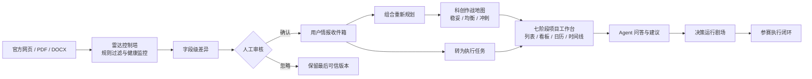
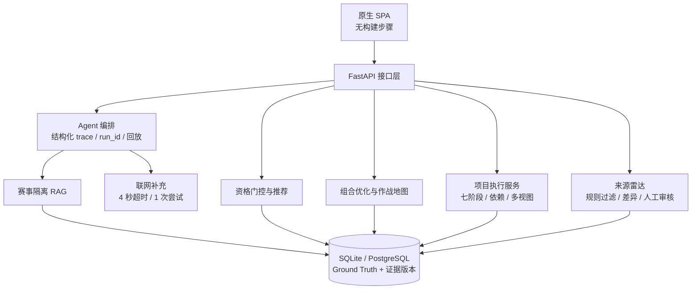

# 校园科创导航智能体 · 参赛作品说明

> 参赛类别：校内 Agent 比赛  
> 版本：V0.5 参赛候选版（2026-08-10）　|　项目仓库：`campus-innovation-agent`

---

## 一、项目概览

**一句话定位**：面向在校生的「可信赛事情报 + 机会决策 + 参赛执行」智能体——不仅回答“参加什么”，还把官方变化、推荐理由、执行任务和最终证据串成一条可审计闭环。

学生准备科创竞赛时，真正困难的并不是搜不到比赛，而是：

1. **信息真假难辨**：网传截止日期、资格和主办单位容易过期或抄错；
2. **决策过程不可解释**：普通问答只给结论，看不到用了哪版数据、经过哪些门控；
3. **发现变化后无法落地**：官网通知更新了，却没有联动到项目风险、任务和重新规划；
4. **执行过程碎片化**：报名、组队、方案、制作、提交和答辩散落在多个工具中；
5. **联网和模型不稳定**：现场网络失败时，系统可能超时、失去证据或直接不可用。

本作品将「官方来源监控 → 噪声过滤 → 字段级差异 → 人工审核 → 可信事实更新 → 组合规划 → 七阶段项目执行 → Agent 问答」串成完整链路，并用“不编造、不静默覆盖、可回放、可降级”四条工程原则贯穿始终。

---

## 二、核心能力

| 能力 | 已实现内容 |
| --- | --- |
| 用户行动首页 | 登录后以“今天最应该先做什么”为首屏焦点，聚合 7 日内节点、未完成事项、项目进度、个性化机会和官方变化；支持一键进入项目、赛事详情或带入 AI 问题。 |
| 赛事大厅检索 | 仅按赛事正式名称检索，避免简介中的类比赛事提及造成误命中；检索与可信状态、类别和年份筛选在前端组合，输入过程中不重复请求赛事接口。 |
| 可信赛事库 | 赛事按年份独立存储；截止日期来自 Ground Truth，不做演示性平移或自动改写；来源核验状态在结果中透明呈现。 |
| 机会提醒与雷达维护 | 学生端只看到“优先处理、当前机会、我的参赛计划”，把官方变化转为下一步；管理员端的“数据维护”才展示扫描、健康度、规则和审核队列。所有可追溯来源分为高频“行动提醒”和每周一次的“资料维护”：后者持续追踪已截止、执行中和往届赛事的新赛季公告、补充通知与结果发布，但只转人工复核、不生成字段写回建议。 |
| 人工审核与用户收件箱 | 关键变化只进入审核队列，绝不自动覆盖可信事实；审核后用户可接受、忽略、转任务或触发重新规划。 |
| 决策运行剧场 | 每次 Agent 问答返回 `run_id` 与结构化业务轨迹，展示节点状态、真实耗时、证据数、数据版本和兜底原因；支持运行历史与冻结输入回放。 |
| 赛事隔离 RAG | 按 `competition_id + 年份 + 文档版本` 隔离检索，避免跨赛事、跨年份串证；语义组件不可用时自动降级为本地检索。 |
| 推荐与资格门控 | 资格、报名状态与基础资料完整性先门控，已截止或硬条件不符赛事一律 `score=null`；来源核验状态透明展示，画像仅用于必要的匹配信息。 |
| 科创机会组合 | 在资格、截止冲突、每周时间与已有项目约束下，输出稳妥、均衡、冲刺三套可行路线。 |
| 科创作战地图 | 将个人技能、能力缺口、赛事、材料和里程碑放到同一张路线图；雷达变化可把下游节点标为风险或阻塞。 |
| 七阶段执行闭环 | 新项目自动生成“资格核对 → 组队选题 → 报名 → 方案 → 制作 → 提交 → 答辩”模板；任务支持依赖、阻塞原因和雷达/证据来源。 |
| 多视图项目管理 | 项目任务可切换列表、看板、日历和跨赛事时间线；Agent 建议可一键转任务，并支持材料管理与 ICS 导出。 |
| 联网快速降级 | 联网补充默认单次超时 4 秒、仅尝试 1 次；失败立即回退本地可信证据链，不拖垮核心问答。 |
| 安全与隐私 | 用户 API 使用短期 HMAC 签名会话绑定资源所有者；管理写操作另用 `X-Admin-Token`；保留 SSRF 防护、最小化采集、画像级联删除与来源追溯。 |

---

## 三、创新点提炼

### 1. 从“黑盒回答”升级为决策运行剧场

系统不展示模型隐式思维链，而是公开评委真正需要核验的业务动作：意图识别、赛事锁定、版本选择、证据检索、资格门控、联网补充和兜底。每个节点都有状态、耗时、证据数和数据版本，每次运行都有唯一 `run_id`；运行摘要持久化到 `agent_runs`，可查看历史并基于冻结输入回放。

**评审价值**：让“输入—处理—输出—兜底”第一次在现场可视、可测、可复现。

### 2. 从“定时抓取”升级为雷达情报控制塔

监控规则可以主动过滤导航栏、时间戳等网页噪声，并把赛事来源拆为两层：仍可行动的赛事高频关注报名、提交等关键字段；已截止、执行中和往届赛事保持低频资料维护，以发现下一赛季公告、补充通知或结果发布。后一层绝不自动提出字段写回，来源连续失败时保留最后可信版本并标记健康异常；任何变化都必须人工确认后才可进入后续处置。

**评审价值**：官网变化不是一条孤立通知，而是能安全进入后续执行的可处置情报。

### 3. 从“单场推荐”升级为三路线科创作战地图

系统不只对赛事逐个打分，而是在资格、时间预算、截止冲突和已有项目约束下求解赛事组合，同时给出稳妥、均衡、冲刺三套路线。作战地图将技能基础、能力缺口、赛事节点、材料与里程碑统一展示；采用方案前会重新校验，任一项失效则整组回滚。

**评审价值**：推荐结果不再是列表，而是一套能解释取舍、能直接执行的校园科创策略。

### 4. 从“加入收藏”升级为七阶段参赛执行闭环

项目创建后自动铺设七阶段模板；任务不仅有完成状态，还可以记录前置依赖、阻塞原因、证据引用和雷达来源。列表、看板、日历、时间线分别服务于日常推进、阶段协作、截止管理和跨赛事资源冲突检查；Agent 的建议可以一键落为任务。

**评审价值**：完成从“知道该做什么”到“真的把事情做完”的最后一公里。

### 5. 把“稳定与安全”做成可见产品能力

联网搜索与本地可信证据严格分域；网络失败默认 4 秒内进入确定性本地路径。签名用户会话、独立管理员令牌、SSRF 防护、最小数据采集、人工审核门和来源追溯共同组成安全边界。

**评审价值**：异常、边界和安全不再只写在文档里，而是有接口、有状态、有兜底。

---

## 四、端到端闭环



这条链路覆盖评审要求中的完整“输入—处理—输出—兜底”：

- **输入**：用户问题、个人必要画像、官方来源变化；
- **处理**：来源过滤、版本识别、隔离检索、资格门控、组合求解；
- **输出**：可解释答案、三条路线、七阶段任务和风险提醒；
- **兜底**：人工审核、来源异常保留可信版本、联网 4 秒降级、失效证据明确标记。

---

## 五、技术架构



**技术栈**：Python + FastAPI + SQLAlchemy + SQLite/PostgreSQL + 本地隔离 RAG（可选 sentence-transformers / Chroma）+ 原生 HTML/CSS/JavaScript。默认不依赖外部模型或网络即可完成可信检索、门控、规划与项目管理；配置 OpenAI 兼容模型后，只对自然语言表达层增强，引用编号与门控结论仍由确定性逻辑保护。

---

## 六、4–6 分钟建议演示路径

1. **用户首页**：登录后先展示“今天最应该先做什么”，从项目阻塞、临近节点、官方变化或最佳匹配中确定一个焦点；下方用三个数字和两列卡片说明原因与下一步。
2. **机会提醒**：进入“机会提醒”，展示“优先处理、当前机会、我的参赛计划”，把一条官方变化转为查看赛事或加入待办。
3. **人工审核并落地**：进入管理员“数据维护”的“赛事监控与异常处理”，确认变化；再回到用户侧展示项目提醒，强调系统绝不自动覆盖可信事实。
4. **查看作战地图**：进入“机会组合”，展示稳妥、均衡、冲刺三条路线，以及技能、缺口、材料、里程碑与风险节点。
5. **发起可信问答**：询问目标赛事截止日期或资格，展开“决策运行剧场”，展示 `run_id`、节点耗时、证据数、数据版本和兜底状态。
6. **进入执行闭环**：将 Agent 建议一键转任务，打开“我的项目”，展示七阶段模板及列表、看板、日历、时间线四种视图。
7. **展示工程兜底**：在“赛事雷达”查看来源健康、自动降级和人工审核门；再用需要联网的问题展示外网失败时默认 4 秒内回退本地证据链。

完整逐秒脚本见 `docs/DEMO_VIDEO_SCRIPT.md`。

---

## 七、数据现状

当前仓库数据口径统一如下：

| 指标 | 数量 |
| --- | ---: |
| 按赛事、年份和赛道隔离的赛事数据 | **179 条** |
| 当前赛事大厅展示的可追溯来源 | **146 条** |
| 已完成核验的赛事 | **18 条** |
| 达到 A 级证据标准的赛事 | **16 条** |

另有 **33 条**无法定位当前赛季官方来源、名称无法纠正或已失效的记录被归档保留审计；系统不编造日期、主办单位或奖项。`verified` 仅表示官网来源与证据通过系统完整性规则，不替代用户最终查看官网和确认资格。

---

## 八、质量、安全与合规

- **59 项自动回归测试**与 **15 条量化指标用例**均已通过，覆盖可信数据、门控、Agent、项目闭环、组合约束、雷达双层监控、动态页指纹、SSRF 与会话隔离。
- 关键断言包括 Ground Truth 与数据库日期一致、已截止赛事 `score=null`、硬性资格不符赛事不进入项目、Agent 同一赛事只输出一个规范化日期、组合采用原子回滚等。
- 用户会话由独立 HMAC 密钥签发，画像、项目、情报收件箱与运行历史必须与会话主体一致；雷达管理写操作另受 `X-Admin-Token` 保护。
- URL 获取保留 SSRF 防护；关键事实更新始终经过人工审核。
- 仅采集推荐所需信息，不要求身份证号、住址等敏感数据；用户可删除画像，关联项目和任务同步删除。
- 证据保留官方链接、获取日期、最近核验日期、文档指纹和版本状态，来源真实可追溯。

测试命令：

```powershell
.\venv\Scripts\python.exe -m unittest discover -s tests -v
.\venv\Scripts\python.exe evals\run_formal_evaluation.py
```

---

## 九、部署与可复现

- **本地**：运行 `start.ps1`，默认访问 `http://127.0.0.1:8000/`；
- **容器**：`docker compose up --build`，SQLite 数据、上传文件与本地检索数据持久化到 `data/`；
- **云端**：仓库已提供 `render.yaml`，可部署 FastAPI 服务与 PostgreSQL；
- **离线可复现**：无 LLM Key、无外网时，核心检索、门控、组合规划和项目执行仍走确定性路径；
- **运行检查**：`GET /health` 提供数据库与后端状态；“赛事雷达”展示当前来源健康、待审核数量与扫描状态。

---

## 十、提交材料清单

| 材料 | 位置 |
| --- | --- |
| 本说明 | `参赛作品说明.md` |
| 创新点单页 | `docs/INNOVATION_HIGHLIGHTS.md` |
| 系统架构与模块说明 | `docs/ARCHITECTURE.md` |
| RAG 架构说明 | `docs/RAG_ARCHITECTURE.md` |
| 部署与依赖说明 | `docs/DEPLOYMENT.md` |
| 数据与隐私合规说明 | `docs/COMPLIANCE.md` |
| 正式测试用例集 | `docs/TEST_CASES.md` |
| 量化评测报告 | `docs/QUANTITATIVE_EVALUATION.md` |
| 固定账号端到端验收记录 | `docs/DEMO_WALKTHROUGH.md` |
| 演示视频脚本 | `docs/DEMO_VIDEO_SCRIPT.md` |
| 演示视频 | `demo/campus-agent-demo-final.mp4`（4 分 25 秒，1080p） |
| 源代码 | `src/` + `frontend/` |
