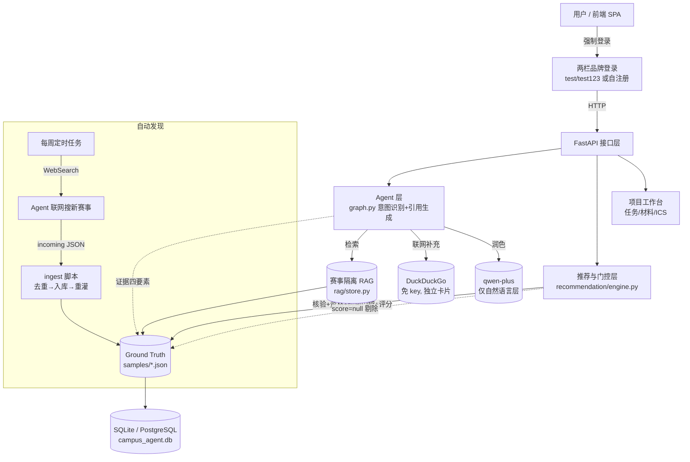

# 校园科创导航智能体 · 参赛作品说明

> 参赛类别：校内 Agent 比赛
> 版本：2026-07-21　|　项目仓库：`campus-innovation-agent`

---

## 一、项目概览

**一句话定位**：面向在校生的「可信赛事导航 + 参赛执行」智能体——不只是推荐比赛，更保证每一条信息都可溯源、不编造。

**要解决的问题**：学生在面对海量赛事信息时，普遍遇到三类痛点：
1. **真假难辨**——网上抄来的截止日期、主办单位经常错；
2. **错过报名**——推荐里混着早已截止的"僵尸赛事"；
3. **硬条件不符仍被推荐**——比如研究生被推荐只收本科生的比赛。

本智能体把「官方通知解析 → 官网来源确认 → 证据完整性检查 → 赛事隔离 RAG → 资格/时间门控 → 个性化推荐 → 项目任务执行 →（可选）联网补充」串成完整闭环，并用一条**反幻觉红线**（找不到官方来源就标 `not_found`，绝不编造）贯穿始终。

---

## 二、核心能力

| 能力 | 说明 |
|------|------|
| 可信赛事库 | 赛事按年份独立存储，报名截止日直接来自 Ground Truth，不做演示性平移或自动改写。 |
| 证据一致问答 | 回答可追溯到官方 PDF/Word 的页码、原文、链接、获取日期与核验日期，带内联 `[n]` 角标。 |
| 推荐门控 | 未核验赛事仅显示为「候选信息」；已截止或硬条件不符的赛事一律 `score=null`，不进推荐。 |
| 画像驱动推荐 | 推荐随学生画像（专业 / 年级 / 学历）明显分化；来源待核实赛事仍进池并标「来源待核实」徽章。 |
| 联网搜索补充 | 问答可触发免 key 的 DuckDuckGo 检索，结果以独立卡片呈现，**绝不混入**本地 `[n]` 引用，保证反幻觉。 |
| 千问润色 | 配置千问 key 后，答案由 `qwen-plus` 做自然语言润色，`[n]` 引用与门控结论不被改写（未配置则回退确定性模板）。 |
| 我的项目 | 把仍可报名且关键证据完整的赛事加入工作台，管理任务计划、材料清单、进度，并导出 ICS 日历。 |
| 隐私可控 | 用户可删除画像，关联项目与任务级联删除；不采集身份证号、住址等敏感信息。 |
| 强制登录 | 每次进入强制重新登录（不记住），两栏品牌登录 UI；比赛演示完全可控，杜绝"一进来就登录态"的歧义。 |

---

## 三、创新点提炼（差异化）

> 与通用 AI 助手 / 普通赛事网站的区别，浓缩为以下六点：

**① 可信赛事库「不编造」机制**
每条赛事带 `official_source_status` 字段：`found`（已锚定官方来源）或 `not_found`（未找到官方链接）。当确无官方出处时，系统**清空证据、保留原始字段、加红字提示**，绝不自动补全日期 / 主办 / 奖项。这是本项目最硬的底线。

**② 证据一致问答（可溯源 + 千问润色）**
Agent 的每条结论都挂接「文档·页码·原文片段·官方链接」四要素，前端渲染为可点击的 `[n]` 角标并平滑滚动到依据卡。配置千问 key 后，`qwen-plus` 仅对自然语言层做润色，`[n]` 与门控结论保持确定性不变。

**③ 赛事隔离 RAG**
检索按 `competition_id`（赛事）+ 年份严格隔离，杜绝跨赛事、跨年份的证据串味；未装语义向量库时自动降级为本地字段/原文匹配，保证离线可跑、结果可控。

**④ 画像驱动推荐 + 时间门控「只推报名中」**
推荐引擎先按学生画像做资格与专业软匹配，只有当前**仍可报名、且符合用户硬条件**的赛事才获得分数；已截止赛事一律 `score=null` 剔除。同一账号切换"计算机 / 工商管理 / 设计 / 文科"等画像，推荐列表会**明显分化**。来源待核实赛事仍进入候选池并标注「来源待核实」徽章，提示报名前二次确认官网。

**⑤ 免 key 联网搜索补充层（反幻觉隔离）**
当问题涉及"最新动态 / 报名通知 / 官网更新"且本地证据不足时，Agent 调用 DuckDuckGo 即时检索（**无需任何 API key**），结果以独立「🌐 联网信息（仅供参考，以官网为准）」卡片呈现，并附来源链接，**绝不混入本地已核验的 `[n]` 引用**——既补足时效性，又不破坏可溯源红线。

**⑥ 每周自动发现闭环**
由定时任务驱动 Agent 用联网搜索发现近 1–2 月新发布 / 报名中的赛事，写成结构化 JSON → 去重入库 → 重灌数据库 →（可选）推送线上，全程遵守反幻觉规则。新赛事默认 `C 级 / 未核验`，不当定论。

---

## 四、技术架构（简易图）

**技术栈**：Python 3.13 + FastAPI + SQLAlchemy + 本地隔离 RAG（可选 sentence-transformers / Chroma 增强）+ 无构建步骤原生前端（HTML/CSS/JS）。默认配置**无需外部模型或网络**即可完成可信检索、门控、推荐与项目管理；配置 LLM Key 后仅对答案做自然语言润色，且引用与门控结论不被改写。联网搜索默认走免 key 的 DuckDuckGo，部署到直连公网（如 Render）即生效。

---

## 五、演示步骤

### 启动方式（任选其一）
- **本地**：`cd src && ../venv/Scripts/python.exe -m uvicorn api:app --host 127.0.0.1 --port 8011` → 打开 http://127.0.0.1:8011/
- **线上（已部署）**：https://campus-innovation-agent.onrender.com
- **容器**：`docker compose up --build`

### 建议演示路径（约 4–6 分钟）
1. **强制登录**：刷新页面即弹出两栏品牌登录页（每次进入都重新登录，不记住）。用测试账号 `test / test123` 登录。
2. **画像驱动推荐（千人千面）**：登录后在画像页切换学生类型（计算机 / 工商管理 / 设计 / 文科），观察推荐列表**明显分化**——计算机偏向软件设计类、文科偏向英语/公文类；来源待核实赛事带「来源待核实」徽章。
3. **证据问答**：问"2026 高教社杯数学建模的报名截止是什么时候？" → 答案带 `[1]` 角标，点击跳到官方依据卡（含页码/原文/链接）。
4. **联网搜索补充**：问"2026 蓝桥杯报名通知 帮我联网查" → 出现蓝色「🌐 联网信息」卡片（真实高校官网链接），与本地 `[n]` 引用并列但不混用。
5. **千问润色**：答案由 `qwen-plus` 生成自然语言版本（本地已配置），引用编号与门控结论不变。
6. **我的项目**：把一条报名中的赛事加入工作台，展示任务计划、材料清单、进度条与 ICS 导出。
7. **可信机制**：打开一条 `not_found` 赛事详情，展示红色「⚠ 未找到官方链接」横幅，说明"不编造"红线。

> 配套演示视频：`demo/campus-agent-demo.mp4`（覆盖强制登录 → 画像推荐分化 → 联网搜索 → 千问问答 → 可信机制的录屏）。

---

## 六、数据现状

仓库现包含 **182 条**按赛事、年份和赛道隔离的赛事数据（截至 2026-07-21）：

| 指标 | 数量 |
|------|------|
| 赛事总数 | 182 |
| 官网来源已锚定（found） | 145 |
| 未找到官方链接（not_found，红字提示、不编造） | 37 |
| 官网来源与五类关键证据完整（trusted=A / verified） | 13 |
| 本月新发现且报名进行中 | 4（AI+信息素养、华为云具身智能、昇腾算子挑战赛、UNIPP 英语应用大赛） |

推荐级赛事的核心字段均关联 PDF 页码或网页原文证据；其他赛事保留为候选信息，不生成正式资格结论或推荐分数。`verified` 仅表示通过来源与证据规则，用户最终仍须查看官网。

---

## 七、质量保障与评测

- **36 条自动回归测试** + **15 条量化指标用例**（覆盖正常 / 异常 / 边界场景），运行 `evals/run_formal_evaluation.py` 生成量化评测报告。
- 关键断言示例：
  - Ground Truth 日期与数据库日期完全一致；
  - 已截止赛事必须 `score=null`；
  - 未核验赛事不得进入正式推荐或「我的项目」；
  - 未知学历不得静默转为「本科生」；
  - Agent 对同一赛事只输出一个规范化截止日期；
  - 联网结果不得混入本地 `[n]` 引用。

---

## 八、部署与可复现

- **本地**：一键 `start.ps1` 或手动 `uvicorn`，SQLite 持久化。
- **容器**：`Dockerfile` + `compose.yaml`，开箱即用。
- **云端**：GitHub `master` 分支 push 即触发 Render Blueprint 自动部署（Web 服务 + 免费 Postgres）；联网搜索默认 DuckDuckGo 免 key，直连公网即生效。
- **离线可复现**：无 LLM Key、无网络时，所有检索 / 门控 / 推荐 / 项目管理均用确定性模板运行，结果稳定可复现。

---

## 九、提交材料清单

| 材料 | 位置 |
|------|------|
| 本说明 | `参赛作品说明.md` |
| 创新点单页（浓缩版） | `docs/INNOVATION_HIGHLIGHTS.md` |
| 系统架构与模块说明 | `docs/ARCHITECTURE.md` |
| RAG 混合检索与赛事隔离创新点 | `docs/RAG_ARCHITECTURE.md` |
| 部署与依赖说明 | `docs/DEPLOYMENT.md` |
| 数据与隐私合规说明 | `docs/COMPLIANCE.md` |
| 正式测试用例集 | `docs/TEST_CASES.md` |
| 量化评测报告 | `docs/QUANTITATIVE_EVALUATION.md` |
| 端到端验收记录 | `docs/DEMO_WALKTHROUGH.md` |
| 演示视频（mp4） | `demo/campus-agent-demo.mp4` |
| 源代码 | `src/` + `frontend/` |
